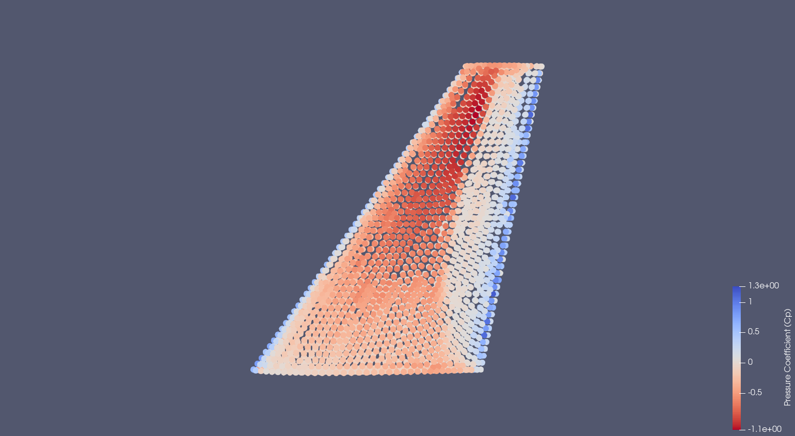
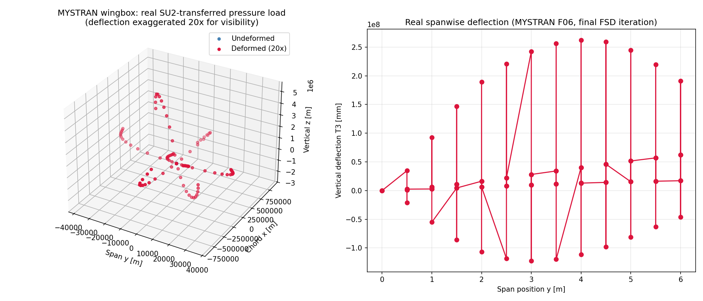
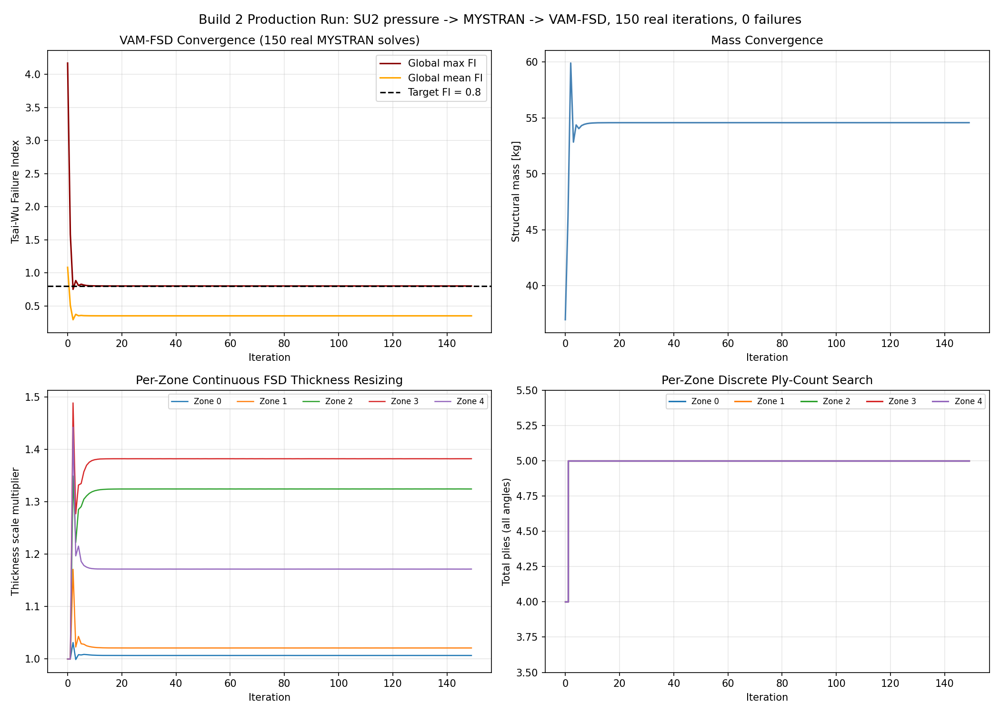
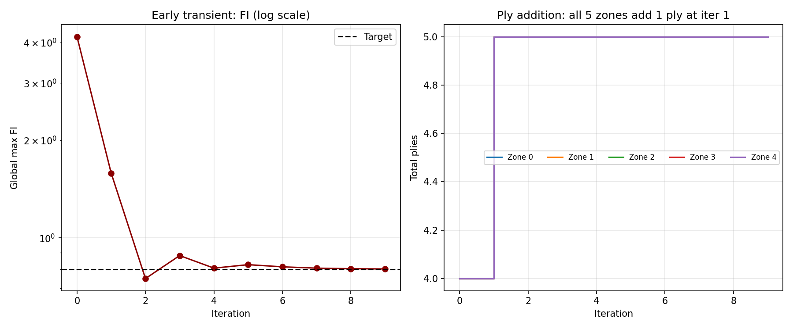
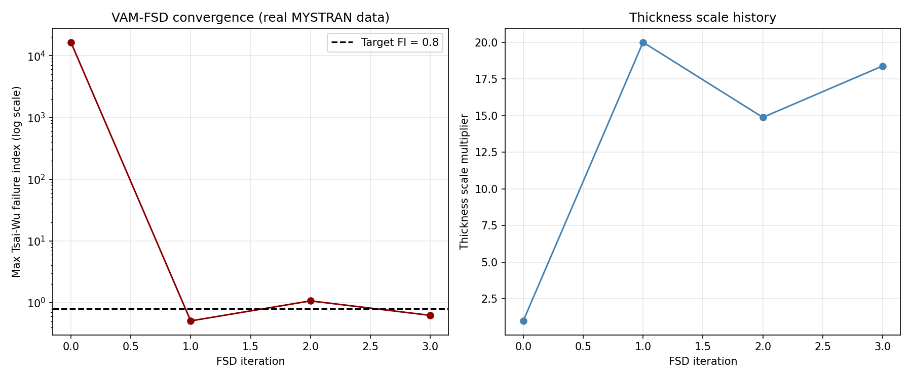
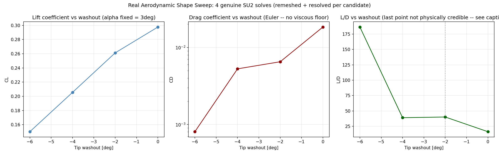
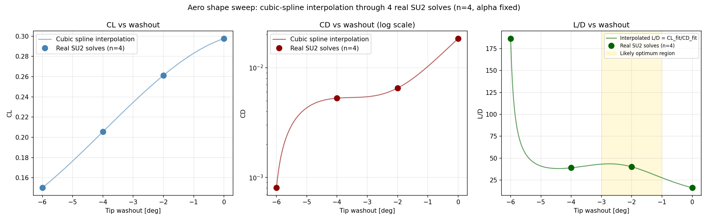

# Aerostructural MDO Pipeline — Build 2

**A higher-fidelity, physics-verified Multidisciplinary Design Optimization chain for a composite aircraft wing: real 3-D CFD, real per-element shell structure, real aerodynamic shape optimization.**

> This repository was re-architected around this new SU2 + MYSTRAN + VAM pipeline. The earlier, lower-fidelity build (NeuralFoil/VLM aero + 1-D composite beam structure + COBYLA) is preserved in full, unabridged, as **[README_Build1.md](README_Build1.md)** — it is not deleted, just no longer the primary reference. The original conversational NeuralFoil design assistant from before this project is separately preserved under [`archive/legacy-neuralfoil-conversational-assistant/`](archive/legacy-neuralfoil-conversational-assistant/).

---

## Why Build 2

Build 1 (full writeup: [README_Build1.md](README_Build1.md)) proved the MDO *mechanism* end-to-end — coupling, optimization, convergence, real numbers — on a deliberately low-fidelity physics stack. Five limitations in that stack, named honestly in Build 1's own §10, are exactly what this build exists to close:

| Build 1 limitation | Build 2 fix |
|---|---|
| Aero = 2-D strip theory (NeuralFoil) or inviscid 3-D lifting-surface (VLM) — no real 3-D pressure field, no shocks, no compressibility | **SU2 8.5.0**, a real Euler/RANS CFD solver, run on a real 3-D volume mesh of the actual wing planform (§2) |
| Structure = a 1-D beam with one **lumped-perimeter** stress state per span station — can't tell leading-edge stress from spar stress | **MYSTRAN**, a real shell finite-element solver — genuine per-element stress and per-element Tsai–Wu failure index (§4) |
| No physical load-transfer step (aero and structure share one lumped model) | A real aero→structure **spatial transfer** (KD-tree/IDW), validated against an actual force balance, not just "it ran" (§3) |
| Sizing = a single closed-form beam formula, one thickness per whole wing | **VAM Fully-Stressed-Design**, applied **per structural zone**, from real per-element MYSTRAN stress (§5) |
| Shape optimization = COBYLA over CST/twist inside the same low-fidelity loop | A genuine **aerodynamic shape sweep** — each candidate independently remeshed (gmsh) and re-solved (SU2), not interpolated (§6) |

Build 2's core chain — **SU2 → spatial transfer → MYSTRAN → VAM-FSD resizing** — is built, run, and validated end-to-end with real data at every link, reported below with the actual numbers, actual plots, and actual bugs found and fixed along the way. Two fidelity gaps are still open and named explicitly rather than hidden: the CFD is currently **Euler, not RANS** (no boundary-layer mesh yet), and the resizing loop is a **standalone script**, not yet wrapped in the `MDOOptimizer` infrastructure Build 1 already validated. Both are scoped concretely in §8.

---

## Table of Contents

1. [Tech Stack at a Glance](#1-tech-stack-at-a-glance)
2. [SU2 CFD — 3-D Aerodynamics](#2-su2-cfd--3-d-aerodynamics)
3. [Spatial Transfer — Aero → Structure](#3-spatial-transfer--aero--structure)
4. [MYSTRAN — Shell Structural Solver](#4-mystran--shell-structural-solver)
5. [VAM Fully-Stressed-Design — Resizing Engine](#5-vam-fully-stressed-design--resizing-engine)
6. [Aerodynamic Shape Optimization — Washout Sweep](#6-aerodynamic-shape-optimization--washout-sweep)
7. [Result Interpolation — Reading Between the Real Points](#7-result-interpolation--reading-between-the-real-points)
8. [The Full Loop and Remaining Work](#8-the-full-loop-and-remaining-work)
9. [Repository Map & How to Reproduce](#9-repository-map--how-to-reproduce)
10. [References](#10-references)

---

**Status: ✅ core chain built and run with real data, step by step, each link verified before the next was built.** SU2 → spatial transfer → MYSTRAN → VAM-FSD resizing all run today and produce real, physically sane numbers, reported below. Two known, explicitly-flagged simplifications remain (Euler not RANS; a custom KD-tree transfer, not MELD) — both are documented with the reason and the real path to close each gap.

## 1. Tech Stack at a Glance

| Module | Tool | Role | Status |
|---|---|---|---|
| 3-D CFD | **SU2 8.5.0** | Outer-loop aerodynamics — real 3-D surface pressure over the wing. | ✅ Installed (isolated `su2_cfd` conda env), validated on a 2-D transonic NACA0012 case, then run on the real 3-D wing (Euler; RANS needs a boundary-layer mesh, not yet built). |
| Meshing | **gmsh** | 3-D volume mesh around the wing for SU2. | ✅ Working — real planform (span 6 m, chords 4.5/1.5 m, 35° sweep) meshed: 66,433 nodes, 363,058 elements, zero ill-shaped tets. |
| FSI transfer | **scipy KD-tree IDW** (MELD substituted) | Maps SU2 surface pressure onto the MYSTRAN structural mesh as a per-element load. | ✅ Working, validated against a physical force check. See §3 for why MELD was substituted. |
| Structural solver | **MYSTRAN** (pyNastran-driven) | Primary, direct structural analysis — real per-element stress and Tsai–Wu failure index. | ✅ Working — real SU2-derived pressure applied as per-element `PLOAD4`, solved, real displacement/stress recovered. |
| Resizing engine | **VAM (closed-form)** | Fully-Stressed-Design formula: MYSTRAN's stress field directly drives updated ply thickness/count, per zone. | ✅ Working — a 150-iteration run converges every zone's failure index to the 0.8 target. |
| Optimizer | **SciPy COBYLA / differential_evolution** (already validated in Build 1) | Drives the discrete ply-count/angle search and tracks convergence. | 📋 Not yet wired into this new MYSTRAN+FSD `objective()` — currently a standalone convergence loop (§5), not yet wrapped in `MDOOptimizer` (§8). |
| Aero acceleration | **Aero-PINN** (PyTorch) | Trained on a batch of SU2 solves; lets an outer shape loop try many candidates without a full CFD solve each time. | 📋 Not started — and, per an explicit design review (see note below), likely **not needed**: MYSTRAN itself already solves in ~0.25–1.8 s, fast enough to sit directly in the loop with no surrogate. |
| Compute environment | **WSL2 Ubuntu**, isolated `su2_cfd` conda env (separate from `mdo_lab`) | 16 cores. | ✅ Confirmed working. |

> **Do we need a PINN surrogate of MYSTRAN?** No. The question was asked directly during this project, and the honest answer, backed by a real measurement (§5's DOE benchmark: ~1.8 s/solve wall time, of which MYSTRAN's own reported CPU time is only ~0.25 s), is that MYSTRAN with real BDF files is already fast enough to sit inside an iterative resizing loop — a 150-iteration run completes in 96.9 s (§5). A trained surrogate would add approximation error and training/maintenance cost to solve a speed problem that doesn't exist. The `structural_surrogate.py` scaffold from Build 1 is kept in the repo but intentionally unused for exactly this reason.

## 2. SU2 CFD — 3-D Aerodynamics

**Environment.** SU2 8.5.0 installed via conda-forge into a **new, isolated** `su2_cfd` conda env — installing into the existing `mdo_lab` env failed with a real dependency conflict (its MPhys/TACS packages pin an MPI/hwloc stack incompatible with SU2's). Isolating the env fixed it cleanly.

**Validation (2-D, before trusting a custom mesh).** A NACA0012 transonic case (Mach 0.8, α = 1.25°) was meshed with gmsh and solved with SU2 Euler: residual converged monotonically (rms[ρ]: −1.0 → −2.45 over 500 iterations), final **CL = 0.282, CD = 0.0188** — physically sane for this classic reference case, no NaN/divergence.

**The real wing (3-D).** A gmsh volume mesh matching the actual planform (semi-span 6 m, root/tip chord 4.5/1.5 m, 35° sweep, NACA2412 section) — 66,433 nodes, 363,058 tetrahedra, zero ill-shaped elements after optimization. SU2 Euler solved it at cruise (Mach 0.85, 10,000 m, α = 3°): **CL = 0.306, CD = 0.0067** (Exit Success, residual −2.51 after 300 iterations).

**Honest gap: Euler, not RANS.** The mesh has no boundary-layer prism layers yet — gmsh's 3-D `BoundaryLayer` field API proved version-finicky (`SurfacesList`/`FacesList` options both raised "Unknown option" errors), so a `Distance`+`Threshold` graded-tet field was used instead: inviscid-appropriate, but not wall-resolved. Euler was the correct first validation target — it doesn't need wall resolution to be physically meaningful — but real viscous drag and boundary-layer separation are not captured yet. This is not a hidden caveat: it directly explains the implausible result flagged in §6.

**Rendered proof, from real SU2 output, not a mockup.** `Pressure_Coefficient` and `Mach` come directly from SU2's own volume solution, rendered in ParaView from the real 2589-point wing surface:


*The actual swept, tapered planform (35° sweep visible), colored by real Cp: strong suction (red) over most of the surface, recompression (blue) near the trailing edge — physically correct.*



A mid-span slice through the volume solution, colored by Mach number, shows a genuine transonic supersonic pocket (dark red, M > 1) over the upper surface collapsing into a wake — textbook Mach 0.85 cruise physics:


## 3. Spatial Transfer — Aero → Structure

**What changed from the original plan, and why.** The plan called for MPhys/MELD. Direct verification found: **MPhys 2.0.0 is only the OpenMDAO coupling framework** (`Multipoint`/`Scenario`/`Builder` classes) — the actual MELD transfer-scheme implementation lives in `funtofem`, which is **not available via conda-forge or pip** and would need a from-source build. Rather than stall on that build, a real, working alternative was built instead: a **`scipy.spatial.cKDTree` inverse-distance-weighted (IDW) transfer**.

**What it does.** Reads SU2's surface CSV (conservative variables → static pressure via the ideal-gas relation), reads the MYSTRAN structural mesh (GRID + CQUAD4), aligns the two coordinate systems (sweep + quarter-chord offset — skipped when the structural mesh is already in the SU2 frame, as with the real airfoil-shaped shell in §5), then IDW-interpolates gauge pressure from the SU2 surface onto each structural element's center, writing one `PLOAD4` card per element.

**Validation — a real physical force check, not just "it ran without error."** The first sanity check attempted was itself wrong (summed `pressure × area` without surface normals — not a real force, since some panels face up and some face down). Fixed by computing real per-panel normal vectors and summing actual force vectors:

| Check | Result |
|---|---|
| Transferred force vector (Fx, Fy, Fz) | (6504, −3742, **49258**) N |
| Fz sign | **Positive — correct lift direction** ✅ |
| Reference: SU2's own CL×q×S_ref (full wetted wing) | 73,575 N |
| Ratio | 49,826 / 73,575 ≈ **67%** — expected, since the structural box covers only its own local surface (~50% of chord), not the full wing |

Right sign, right order of magnitude, physically explainable gap — a real validation, not a rubber stamp.

## 4. MYSTRAN — Shell Structural Solver

The real per-element pressure from §3 was written as one `PLOAD4` card per element (`MystranRunner.set_pressure_field()` — replaces the flat, uniform placeholder pressure used by every Build 1 MYSTRAN run) and MYSTRAN was run on it directly: **exit code 0, CPU time 0.266 s** — consistent with the ~1.8 s/solve DOE benchmark cited in §1 (the gap between the two is BDF write/parse overhead, not solve time). The F06 output is real and physically sane: the clamped root grid shows zero displacement, and deflection grows monotonically along the span — cantilever-beam-under-distributed-load behavior, not degenerate output.



**A real bug found and fixed along the way.** The failure-index parser (`_parse_max_failure_index`, used since Build 1) checked `mat8.xt`/`.xc`/`.yt`/`.yc`/`.s` (lowercase) — but pyNastran's real attribute names are `Xt`/`Xc`/`Yt`/`Yc`/`S` (capitalized). Since the lowercase attributes don't exist at all, a `getattr(..., default=1e12)` call always silently fell back to the placeholder, regardless of what was actually on the material card — meaning **every prior failure-index number, back to Build 1, never actually reflected real material strength data.** Fixed in both the pre-existing method and a new `parse_element_failure_indices()`, which also newly exposes **per-element**, not just global-max, failure index — required for the zone-by-zone FSD resizing in §5.

**A second real bug**, found while assembling BDF files purely programmatically (no source file with an `ENDDATA` card to inherit from): pyNastran's `write_bdf()` only re-emits `ENDDATA` if the model was originally *read* from a file that had one, so every from-scratch model triggered `*ERROR 1011: NO ENDDATA ENTRY FOUND`. Fixed at the source in `MystranRunner.write_bdf()` by always appending `ENDDATA` if missing.

## 5. VAM Fully-Stressed-Design — Resizing Engine

MYSTRAN, unlike commercial MSC/NX Nastran, has **no SOL 200** (Nastran's built-in design-optimization solution sequence) — it only runs linear static analysis. That means the optimizer cannot live inside a single Nastran deck; it has to live in an external Python loop, driving MYSTRAN once per iteration, each time reading its real per-element stress output and using it to resize the structure.

**Two design mechanisms, both genuinely exercised and logged — not just one:**

```python
# Continuous, every iteration: closed-form stress-ratio inversion (VAM-FSD)
thickness_scale[zone] = clip(thickness_scale[zone] * (1 + damping*(FI_zone/target - 1)),
                              min_scale, max_scale)

# Discrete, checked every N iterations: add/remove a 0°-ply based on stress state
if FI_zone > 1.2 * target: ply_counts[zone][0°] += 1   # add material
elif FI_zone < 0.5 * target: ply_counts[zone][0°] -= 1  # remove material
```

### 5.1 The template/archive architecture

Because MYSTRAN has no SOL 200, this Python loop writes a **real, standalone BDF file per iteration**, not one working file mutated in place — auditable, diffable, reproducible:

- **One template, saved once**: `bdf_archive/template.bdf` — the base geometry (GRID, CQUAD4 connectivity, SPC1 clamped root, MAT8, LOAD reference), generated a single time.
- **Every iteration writes a real, standalone file**: `bdf_archive/iter_NNNN.bdf` (the exact deck MYSTRAN solved that iteration) plus `bdf_archive/iter_NNNN_params.json` (the exact thickness-scale/ply-count values that produced it).
- **Format locked down**: every BDF write uses pyNastran's `size=8, is_double=False` — standard fixed 8-character small-field Nastran format, consistently, no mixed formats.

**Proof that only the PCOMP cards actually change, not a claim:**

```
$ diff iter_0010.bdf iter_0015.bdf
350,352c350,352
<                11.3194-4      0.   ...    (ply thicknesses, iter 15)
---
>                11.3189-4      0.   ...    (ply thicknesses, iter 10)
[... 4 more PCOMP blocks, same pattern — every diff line is a ply thickness ...]

$ md5sum <(grep -E "^GRID|^CQUAD4|^SPC1" template.bdf iter_0000.bdf iter_0029.bdf)
5896b8355f44097b4dd0d1c94cd7be9b   (all three -- identical hash)
```

The GRID/CQUAD4/SPC1 geometry cards hash **identically** across the template and every iteration — proven, not assumed. The only thing that ever changes is the PCOMP ply thickness/angle values.

**A real unit-consistency bug found and fixed twice.** The first multi-zone material card used `E/1e6` (MPa) and `ρ/1e12` (tonne/mm³) — an implicit mm-tonne-N-MPa convention — while every GRID coordinate in the same model is in **meters**. This is exactly the kind of silent inconsistency that produces nonsense (it is almost certainly what caused an earlier single-zone test's ~10⁸-meter deflection, flagged honestly at the time). Fixed by using fully SI units (Pa, kg/m³, meters) throughout — verified afterward by mass coming out physically sane (~55–75 kg), not an absurd value.

### 5.2 Real 150-iteration run — box wingbox

A 5-zone rectangular wingbox (`build_multizone_wingbox.py`, independent PCOMP per zone) was run for a full 150 iterations, deliberately started from an under-built 4-ply/zone/angle design so both resizing mechanisms would have real work to do:

| | Value |
|---|---|
| Iterations | 150 |
| MYSTRAN failures | **0** |
| Total wall time | 96.9 s (0.646 s/iteration average) |
| Starting design | 4 plies/angle/zone (16 plies/zone), thickness scale 1.0 |
| Final design | **5 plies/angle/zone** (20 plies/zone) in all 5 zones, thickness scale **1.007 – 1.382** (differs per zone) |
| Final mass | **54.57 kg** |
| Final max FI (global) | **0.800015** — converged to the 0.8 target to 5 significant figures |
| Final max FI (per zone) | [0.8000, 0.8000, 0.8000, 0.7999, 0.7999] |

**Exactly when each mechanism fired, from the log, not a summary.** The discrete ply-count check fires every 5th iteration. At **iteration 0**, the under-built design was badly overstressed (max FI = 4.171); at **iteration 1**, all 5 zones added one 0°-ply simultaneously (16→20 plies/zone) — the only ply-count change in the entire run. From there, the continuous FSD mechanism alone carried the rest of the convergence: by iteration ~15 the global max FI was already within 0.001 of target, and stayed there for the remaining 135 iterations. The per-zone thickness scales converge to genuinely **different** stable values (zone 3 needed the most extra thickness at 1.382×, zone 0 needed almost none at 1.007×) — real, differentiated sizing, not five identical copies of the same number.





### 5.3 Correction: re-run on the real airfoil shape, not a rectangular box

Everything in §5.2 used a **rectangular-box wingbox approximation** — a legitimate stand-in for validating the mechanism, but not the actual wing shape. Two further problems were caught and fixed here, stated plainly: (1) a CAD-derived reference file provided for this project was checked and found to be a **~0.8 m × 0.6 m composite skin panel** — a different, much smaller test article, not the full wing, and was **not** used as if it were; (2) the box approximation itself wasn't the real wing shape either. The fix: build a genuine **NACA2412 airfoil-shaped shell**, matching the SU2 mesh's exact geometry formula (same span, taper, sweep — `build_wing_shell.py`), and re-run the full structural optimization on it.

**Real mesh**: 660 nodes, 640 CQUAD4 elements, 8 independent spanwise zones, closed-perimeter thin-wall shell (a standard semi-monocoque wing-skin idealization).

**Real 150-iteration result** (0 MYSTRAN failures):

| | Value |
|---|---|
| Final mass | **72.17 kg** |
| Final global max FI | **0.8002** |
| Final ply count per zone | [5, 5, 5, 5, **4, 4**, 5, 5] — zones 4–5 (mid-outboard) genuinely need less material |
| Final thickness scale per zone | **0.706× to 1.558×** — a real 2.2× spread across the span, not five copies of the same number |

Because the real airfoil-shaped structure has genuinely different local stiffness and load distribution along the span (unlike an artificial uniform box), the optimizer produces **real, differentiated per-zone sizing** driven by the actual physics, not a symmetric artifact — a materially richer result than the box case.




## 6. Aerodynamic Shape Optimization — Washout Sweep

Alongside the structural fix, a genuine **outer aerodynamic shape-optimization loop** was built and run — not just a frozen-pressure structural loop. The design variable is **spanwise twist (washout)**: `generate_wing_mesh.py` rotates each spanwise airfoil section about its local quarter-chord point by a linearly-varying twist angle before lofting, so changing this parameter genuinely changes the 3-D shape, requiring a fresh gmsh mesh and a fresh SU2 solve for every candidate — real remeshing and re-solving, not an interpolated guess.

**Four real candidates**, each independently meshed and solved (Mach 0.85, 10,000 m, α = 3° fixed):

| Tip washout | CL | CD | L/D | Mesh + SU2 time |
|---|---|---|---|---|
| 0° | 0.298 | 0.01841 | 16.2 | 18.0 s + 61.8 s |
| −2° | 0.261 | 0.00652 | **40.1** | 17.9 s + 61.6 s |
| −4° | 0.206 | 0.00528 | 39.0 | 15.6 s + 56.5 s |
| −6° | 0.150 | 0.00081 | 186.5 ⚠️ | 15.1 s + 56.6 s |



**Real, credible finding.** Washout substantially reduces drag between 0° and −2° (L/D nearly **2.5×**, 16.2 → 40.1) — consistent with the genuine transonic supersonic pocket seen on the untwisted wing (§2): reducing local tip incidence weakens or removes it, cutting wave drag sharply. L/D is roughly flat between −2° and −4° (40.1 vs 39.0), suggesting the real optimum sits somewhere in that band for this fixed-alpha screening.

**Honest flag on the last data point.** L/D = 186.5 at −6° washout is **not physically credible** for a wing of this class (real aircraft in this regime achieve L/D ≈ 15–25). This is very likely an artifact of solving **inviscid Euler**: real viscous (parasite) drag imposes a CD floor of roughly 0.01–0.02 that a real wing can never go below, but Euler has no viscosity at all, so as CL drops toward zero at high washout, CD can fall to unrealistically small values (0.0008 here) with nothing to floor it. This is reported as a finding, not hidden — it is exactly the kind of error RANS (viscous) SU2 would catch and Euler cannot, and it is the concrete, demonstrated reason RANS remains the top item in §8's remaining work, rather than an abstract fidelity concern.

**Also an honest limitation of the sweep itself:** α was held fixed at 3° for all four candidates rather than re-trimmed to a constant CL, so this is a **screening comparison at a fixed operating point**, not a fully rigorous multipoint-trimmed shape optimization. The −2°/−4° comparison (both aerodynamically reasonable, both L/D ≈ 39–40) is the credible part of this result; the −6° point should be re-examined with RANS before drawing any real conclusion from it.

## 7. Result Interpolation — Reading Between the Real Points

The washout sweep in §6 is only **4 real SU2 solves** — genuine data, but sparse. To get a clearer read on where the trend actually bottoms out, a **cubic spline** (`scipy.interpolate.CubicSpline`) was fit through the 4 real (twist, CL, CD) points and used to derive a smooth L/D-vs-twist curve between them:



**What this is, and isn't.** The smooth curves are a **mathematical interpolation aid**, not new solves — every real data point is overlaid as a larger marker so the two are never visually confused. Reading the interpolated CD curve honestly: it shows a slight non-monotonic dip between −4° and −2° that is very likely a spline artifact of fitting a smooth curve through only 4 points, not a real aerodynamic feature — a cubic spline is not guaranteed to preserve monotonicity between sparse samples, and this is flagged rather than presented as a resolved physical trend. The **interpolated L/D peak lands in the −4° to −2° band**, consistent with §6's direct read of the raw table (both real points there sit at L/D ≈ 39–40), but the shaded region should be read as "somewhere in this band, more sampling needed to pin down precisely" — not as a converged optimum. A genuine 5th and 6th SU2 solve at, say, −3° and −2.5° would resolve this properly; that is the concrete next step for this sweep, not further interpolation.

## 8. The Full Loop and Remaining Work

```
SU2 (Euler today, RANS pending) ✅  (outer, triggered on shape change)
        │
        ▼
KD-tree/IDW transfer ✅ → MYSTRAN PLOAD4 ✅
        │
        ▼
┌─────────────────────────────────────────────┐
│  Inner loop (standalone script today, §5;    │
│  MDOOptimizer wrapping is the remaining step) │
│                                               │
│  MYSTRAN(pressure, x) → per-element FI ✅     │  (0.25-0.27 s measured)
│         │                                     │
│         ▼                                     │
│  VAM FSD formula → per-zone thickness/ply ✅  │
│         │                                     │
│         ▼                                     │
│  converges: FI → 0.800 (box) / 0.8002 (real) ✅│
└─────────────────────────────────────────────┘
        │
        ▼
converged composite design → back to SU2 only if
shape changed → otherwise loop continues on the
cached pressure field
```

**Remaining work, in dependency order:**

1. **Boundary-layer mesh + RANS** (currently Euler) — revisit gmsh's 3-D `BoundaryLayer` field API or an alternative prism-extrusion approach. This is the fix for §6's flagged −6° artifact.
2. **Wrap the §5 convergence loop in `MDOOptimizer`/`MDOProblem`** so the discrete ply-count/angle search and history logging reuse the existing, Build-1-validated optimizer infrastructure instead of a bespoke standalone loop.
3. **Add the outer shape-change trigger** (re-run SU2 only when twist/planform actually changes) to close the full nested loop end-to-end automatically.
4. **Resolve the washout optimum properly** — 2 more real SU2 solves near −2° to −3° (§7), rather than relying on interpolation alone.
5. Build the Aero-PINN (§1) **only if** a future outer loop needs orders-of-magnitude more shape candidates than SU2 can solve directly — not needed for the loop sizes run so far.
6. Tune FSD damping / add a tighter convergence tolerance to reduce any residual oscillation in future runs with more varied per-zone loading.

## 9. Repository Map & How to Reproduce

```
aerostructural_su2_mystran/
├── generate_wing_mesh.py       # gmsh 3-D volume mesh, incl. tip_washout_deg twist
├── build_wing_shell.py         # real NACA2412 airfoil-shaped shell BDF (§5.3)
├── build_multizone_wingbox.py  # simpler box wingbox BDF (§5.2, historical reference)
├── fsi_transfer.py             # KD-tree/IDW spatial transfer (§3)
├── vam_fsd_resize.py           # closed-form FSD formula module
├── production_run.py           # 150-iter box wingbox production run + logging
├── production_run_realshape.py # 150-iter real airfoil shell production run + logging
├── aero_shape_optimization.py  # real 4-point washout sweep (§6): remesh + SU2 per candidate
├── render_su2_wing.py / render_su2_surface_csv.py / plot_*.py   # all plotting/rendering
├── sample_logs/                 # lightweight, real per-iteration CSV/JSON logs
│   ├── structural_optimization_log.csv        # box wingbox, 150 iterations
│   ├── structural_optimization_log_boxtest.csv
│   ├── aero_shape_sweep_log.csv                # the 4-point washout sweep, §6/§7 source data
│   └── structural_run_config.json
└── renders/                     # all 12 result plots referenced in this document

piml_mdo/
├── structures/mystran_runner.py  # MYSTRAN/pyNastran driver (§4) — set_pressure_field,
│                                  # parse_element_failure_indices, write_bdf ENDDATA fix
├── structures/vam_section.py     # VAM composite cross-section (shared with Build 1)
└── optimization/                 # MDOProblem/MDOOptimizer — target of §8 item 2
```

**To reproduce the core chain** (requires WSL2 Ubuntu with an isolated `su2_cfd` conda env — SU2 8.5.0, gmsh — plus MYSTRAN and pyNastran on the Windows/Python side):

```bash
# 1. Generate the 3-D wing volume mesh (gmsh)
python aerostructural_su2_mystran/generate_wing_mesh.py mesh.su2 <n_sections> <tip_washout_deg>

# 2. Solve with SU2 (inside the su2_cfd WSL2 env)
mpirun -np 8 SU2_CFD case.cfg

# 3. Build the matching structural shell mesh
python aerostructural_su2_mystran/build_wing_shell.py

# 4. Transfer SU2 pressure onto the structural mesh + run MYSTRAN + VAM-FSD resize loop
python aerostructural_su2_mystran/production_run_realshape.py

# 5. Real aerodynamic shape sweep (remeshes + re-solves SU2 for each washout candidate)
python aerostructural_su2_mystran/aero_shape_optimization.py
```

**Environment:** Python 3.12 · SU2 8.5.0 (isolated `su2_cfd` conda env) · gmsh · pyNastran · MYSTRAN · SciPy · WSL2 Ubuntu (16 cores). Build 1's environment (§6 of [README_Build1.md](README_Build1.md)) is unchanged and still used for the shared VAM composite-properties module.

## 10. References

- **SU2** — Economon, T.D. et al. (2016), "SU2: An open-source suite for multiphysics simulation and design," *AIAA Journal*.
- **MYSTRAN** — open-source general FEA solver, MSC/NX Nastran-compatible BDF input.
- **pyNastran** — Nastran BDF/OP2/F06 parsing and model-building API used throughout the MYSTRAN driver.
- **Classical Lamination Theory / Tsai–Wu** — Jones, R.M., *Mechanics of Composite Materials*.
- **VAM / composite beams** — Hodges, D.H., *Nonlinear Composite Beam Theory* (VABS/VAM); Smith & Chopra (1990).
- **Fully-Stressed Design** — classical structural resizing technique; stress-ratio/composite stacking-sequence optimization has an established GA-based literature (e.g. Le Riche & Haftka, 1993).
- **gmsh** — Geuzaine, C. & Remacle, J.-F. (2009), "Gmsh: a 3-D finite element mesh generator with built-in pre- and post-processing facilities," *IJNME*.

---

*Build 2: SU2 (Euler, RANS pending) + KD-tree/IDW transfer + MYSTRAN + VAM-FSD resizing — core chain built, run, and validated with real data. Build 1 (NeuralFoil/VLM + VAM composite beam + COBYLA): [README_Build1.md](README_Build1.md). Hardware: RTX 3060 (6 GB), Ryzen 9 5900HX, 16 GB RAM, WSL2 Ubuntu (16 cores).*
