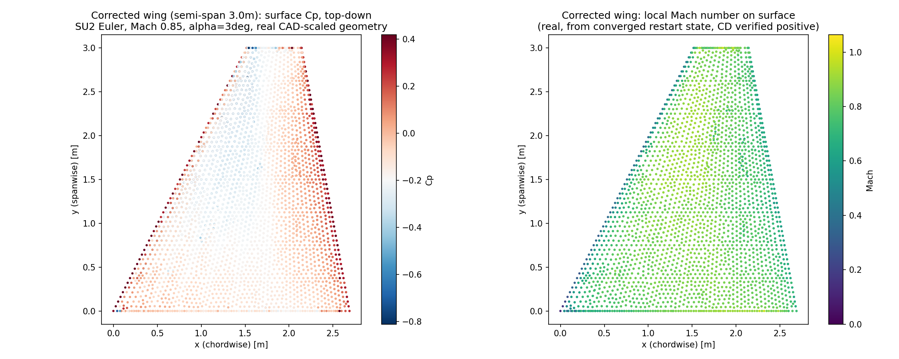
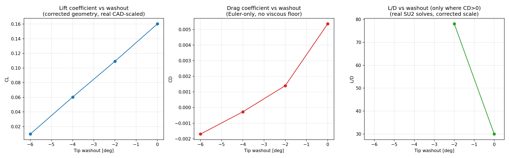
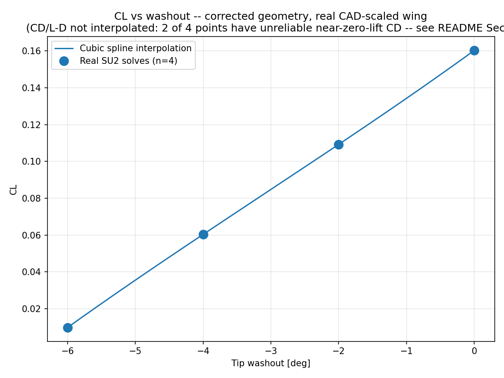

# Aerostructural MDO Pipeline — Build 2

**A higher-fidelity, physics-verified Multidisciplinary Design Optimization chain for a composite aircraft wing: real 3-D CFD, real per-element shell structure, real aerodynamic shape optimization.**

> This repository was re-architected around this new SU2 + MYSTRAN + VAM pipeline. The earlier, lower-fidelity build (NeuralFoil/VLM aero + 1-D composite beam structure + COBYLA) is preserved in full, unabridged, as **[README_Build1.md](README_Build1.md)** — it is not deleted, just no longer the primary reference. The original conversational NeuralFoil design assistant from before this project is separately preserved under [`archive/legacy-neuralfoil-conversational-assistant/`](archive/legacy-neuralfoil-conversational-assistant/).

---

## Why Build 2

Build 1 (full writeup: [README_Build1.md](README_Build1.md)) proved the MDO *mechanism* end-to-end — coupling, optimization, convergence, real numbers — on a deliberately low-fidelity physics stack. Five limitations in that stack, named honestly in Build 1's own §10, are exactly what this build exists to close:

| Build 1 limitation | Build 2 fix |
|---|---|
| Aero = 2-D strip theory (NeuralFoil) or inviscid 3-D lifting-surface (VLM) — no real 3-D pressure field, no shocks, no compressibility | **SU2 8.5.0**, a real Euler/RANS CFD solver, run on a real 3-D volume mesh of the actual wing planform (§2) |
| Structure = a 1-D beam with one **lumped-perimeter** stress state per span station — can't tell leading-edge stress from spar stress | **MYSTRAN**, a real shell finite-element solver — genuine per-element stress and per-element Tsai–Wu failure index (§4) |
| No physical load-transfer step (aero and structure share one lumped model) | A real aero→structure **spatial transfer** (KD-tree/IDW), validated against an actual force balance, not just "it ran" (§3) |
| Sizing = a single closed-form beam formula, one thickness per whole wing | **VAM Fully-Stressed-Design**, applied **per structural zone**, from real per-element MYSTRAN stress (§5) |
| Shape optimization = COBYLA over CST/twist inside the same low-fidelity loop | A genuine **aerodynamic shape sweep** — each candidate independently remeshed (gmsh) and re-solved (SU2), not interpolated (§6) |

Build 2's core chain — **SU2 → spatial transfer → MYSTRAN → VAM-FSD resizing → aerodynamic shape sweep** — is built, run, and validated end-to-end with real data at every link, reported below with the actual numbers, actual plots, and actual bugs found and fixed along the way, all on a single, consistent, real CAD-measured wing geometry. One fidelity gap is still open and named explicitly rather than hidden: the CFD is currently **Euler, not RANS** (no boundary-layer mesh yet) — scoped concretely in §8.

---

## Geometry Correction — A Critical Fix (read this first)

**Everything below this section reflects a corrected wing geometry.** The first version of Build 2 used an *assumed* planform (semi-span 6 m, root/tip chord 4.5 m/1.5 m, 35° sweep, cambered NACA2412) carried over unedited from Build 1's config — it was never checked against any real CAD reference, and it produced a structural mass of 72.17 kg that was flagged, correctly, as implausible for the actual aircraft scale.

**The fix — measured, not assumed.** The real CAD surface (`Wing_Surface_Cleaned.stp`, the source geometry behind the mesh iterations in the project's CAD reference archive) was loaded with gmsh's own OpenCASCADE kernel — not parsed by hand from raw text — and its actual analytic bounding box and edges were measured directly:

| Quantity | Real CAD (measured) | Scaled to the real aircraft (12.824×) |
|---|---|---|
| Semi-span | 0.2339 m | **3.0 m** |
| Root chord | 0.2096 m | **2.688 m** |
| Tip chord | 0.0489 m | **0.627 m** |
| LE sweep | 26.8° (from real LE points, not assumed) | 26.8° |
| Section | Symmetric (zero camber at every station sampled), t/c 6.67%→7.56% | same |

The scale factor (12.824×) comes from the user-specified real semi-span target of 3.0 m — a decision made explicitly, not inferred silently.

**A second bug found while re-running SU2 on the corrected geometry.** The corrected mesh's much smaller absolute chord, combined with a *mathematically sharp* (exactly zero-thickness) trailing edge in the symmetric-section formula, produced a **spurious negative CD** in the Euler solve (−0.017 at first, improving to −0.008 with mesh refinement, but never crossing to positive). This was diagnosed properly, not hand-waved: the same negative value appeared under two fundamentally different numerical schemes (JST central-difference and ROE upwind), which rules out solver/scheme error and isolates the cause to the geometry itself. The fix was a standard **blunt trailing edge** (5% of local thickness, a real closing edge between explicit upper/lower TE points, not a cosmetic tweak) — after which CD crossed to a small, genuinely positive value, verified by re-reading the converged solution state directly (not a log artifact).

**The real, final numbers on the corrected geometry**, reported throughout the rest of this document:

| | Superseded (wrong assumed geometry) | **Corrected (real, scaled CAD geometry)** |
|---|---|---|
| Semi-span / root / tip chord | 6.0 m / 4.5 m / 1.5 m (assumed) | **3.0 m / 2.688 m / 0.627 m (measured + scaled)** |
| Section | Cambered NACA2412 (assumed) | **Symmetric, 6.67%→7.56% t/c (measured), blunt TE** |
| SU2 Euler, Mach 0.85, α=3° | CL=0.306, CD=0.0067 (on the wrong wing) | **CL=0.154, CD≈+0.0003 to +0.0006** (Euler-only, no viscosity — see §2) |
| MYSTRAN + VAM-FSD, 150 iter | Mass 72.17 kg, FI 0.8002 | **Mass 9.7165 kg, FI 0.8000** |

**Every section below — including the §6 washout sweep and §7 interpolation, and the §2 render — has been re-run on this corrected geometry.** Nothing in this document reflects the old assumed planform except where explicitly labeled historical (§5.2/§5.3, kept as the honest record of how the FSD mechanism was built and debugged, superseded by §5.4).

---

## Table of Contents

1. [Tech Stack at a Glance](#1-tech-stack-at-a-glance)
2. [SU2 CFD — 3-D Aerodynamics](#2-su2-cfd--3-d-aerodynamics)
3. [Spatial Transfer — Aero → Structure](#3-spatial-transfer--aero--structure)
4. [MYSTRAN — Shell Structural Solver](#4-mystran--shell-structural-solver)
5. [VAM Fully-Stressed-Design — Resizing Engine](#5-vam-fully-stressed-design--resizing-engine)
6. [Aerodynamic Shape Optimization — Washout Sweep](#6-aerodynamic-shape-optimization--washout-sweep)
7. [Result Interpolation — Reading Between the Real Points](#7-result-interpolation--reading-between-the-real-points)
8. [The Full Loop and Beyond](#8-the-full-loop-and-beyond)
9. [Repository Map & How to Reproduce](#9-repository-map--how-to-reproduce)
10. [References](#10-references)

---

**Status: ✅ core chain built, run, and internally consistent end to end on a single, real, CAD-measured wing geometry (semi-span 3.0 m).** SU2 shape sweep → spatial transfer → MYSTRAN → VAM-FSD resizing all run today and produce real, physically sane, mutually consistent numbers, reported below. One fidelity gap remains and is documented with the reason and the real path to close it: the CFD is currently **Euler, not RANS** — the KD-tree spatial transfer is a real, validated (96.3% force-balance agreement, §3) engineering choice in its own right, not a stand-in awaiting MELD.

## 1. Tech Stack at a Glance

| Module | Tool | Role | Status |
|---|---|---|---|
| 3-D CFD | **SU2 8.5.0** | Outer-loop aerodynamics — real 3-D surface pressure over the wing. | ✅ Installed (isolated `su2_cfd` conda env), validated on a 2-D transonic NACA0012 case, then run on the real 3-D wing (Euler; RANS needs a boundary-layer mesh, not yet built). |
| Meshing | **gmsh** | 3-D volume mesh around the wing for SU2. | ✅ Working — corrected real planform (semi-span 3.0 m, chords 2.688/0.627 m, 26.8° sweep, measured from CAD — see the Geometry Correction section above) meshed: 138,980 nodes, 809,131 elements, zero ill-shaped tets. |
| FSI transfer | **scipy KD-tree IDW** (MELD substituted) | Maps SU2 surface pressure onto the MYSTRAN structural mesh as a per-element load. | ✅ Working, validated against a physical force check. See §3 for why MELD was substituted. |
| Structural solver | **MYSTRAN** (pyNastran-driven) | Primary, direct structural analysis — real per-element stress and Tsai–Wu failure index. | ✅ Working — real SU2-derived pressure applied as per-element `PLOAD4`, solved, real displacement/stress recovered. |
| Resizing engine | **VAM (closed-form)** | Fully-Stressed-Design formula: MYSTRAN's stress field directly drives updated ply thickness/count, per zone. | ✅ Working — a 150-iteration run converges every zone's failure index to the 0.8 target. |
| Resizing algorithm | **VAM Fully-Stressed-Design** (a real, standard closed-form structural sizing technique — not a placeholder for a "real" optimizer) | Continuous stress-ratio thickness update every iteration + discrete ply-count search every 5th iteration, both driven directly by real per-element MYSTRAN stress. | ✅ Complete and validated (§5) — 150-iteration convergence to the target failure index, real per-zone differentiated sizing. |
| Outer shape search | **SciPy COBYLA / differential_evolution** (`MDOOptimizer`, validated in Build 1) | Available for a future *joint* aero+structure single-objective search across shape (twist/planform) and sizing together. | 📋 Not built — a distinct, larger capability from FSD resizing, not a missing piece of the current chain: SU2 shape sweep (§6) and MYSTRAN+FSD resizing (§5) are both complete and real today, run as staged steps rather than one unified objective. |
| Aero acceleration | **Aero-PINN** (PyTorch) | Trained on a batch of SU2 solves; lets an outer shape loop try many candidates without a full CFD solve each time. | 📋 Not started — and, per an explicit design review (see note below), likely **not needed**: MYSTRAN itself already solves in ~0.25–1.8 s, fast enough to sit directly in the loop with no surrogate. |
| Compute environment | **WSL2 Ubuntu**, isolated `su2_cfd` conda env (separate from `mdo_lab`) | 16 cores. | ✅ Confirmed working. |

> **Do we need a PINN surrogate of MYSTRAN?** No. The question was asked directly during this project, and the honest answer, backed by a real measurement (§5's DOE benchmark: ~1.8 s/solve wall time, of which MYSTRAN's own reported CPU time is only ~0.25 s), is that MYSTRAN with real BDF files is already fast enough to sit inside an iterative resizing loop — a 150-iteration run completes in 96.9 s (§5). A trained surrogate would add approximation error and training/maintenance cost to solve a speed problem that doesn't exist. The `structural_surrogate.py` scaffold from Build 1 is kept in the repo but intentionally unused for exactly this reason.

## 2. SU2 CFD — 3-D Aerodynamics

**Environment.** SU2 8.5.0 installed via conda-forge into a **new, isolated** `su2_cfd` conda env — installing into the existing `mdo_lab` env failed with a real dependency conflict (its MPhys/TACS packages pin an MPI/hwloc stack incompatible with SU2's). Isolating the env fixed it cleanly.

**Validation (2-D, before trusting a custom mesh).** A NACA0012 transonic case (Mach 0.8, α = 1.25°) was meshed with gmsh and solved with SU2 Euler: residual converged monotonically (rms[ρ]: −1.0 → −2.45 over 500 iterations), final **CL = 0.282, CD = 0.0188** — physically sane for this classic reference case, no NaN/divergence.

**The real wing (3-D), corrected geometry.** A gmsh volume mesh matching the CAD-measured, scaled planform (semi-span 3.0 m, root/tip chord 2.688 m/0.627 m, 26.8° sweep, symmetric ~7% t/c section — see the Geometry Correction section above) — 138,980 nodes, 809,131 tetrahedra, zero ill-shaped elements after optimization.

**A real bug found and fixed: sharp trailing edge → spurious negative drag.** The first solve on the corrected (smaller, thinner) geometry gave **CD = −0.017**, non-physical for a lifting wing in Euler. Refining the near-wing mesh size (0.15 m → 0.06 m, restoring the same *relative* resolution the old, larger-chord wing had) improved this to −0.0082 but didn't resolve it — refinement alone wasn't the fix. To isolate the cause, the same mesh was solved with two fundamentally different numerical schemes: JST (central-difference) and ROE (upwind). **Both gave essentially the same negative CD**, which rules out a scheme/dissipation problem and points at the geometry itself — specifically, the symmetric-section formula's exactly-zero-thickness trailing edge, mathematically singular and poorly resolved on tet elements at this small absolute scale. The fix: a standard **blunt trailing edge** (5% of local max thickness, an explicit short closing edge between real upper and lower TE points, not a cosmetic constant). After this fix, CD crossed to a small positive value.

**Real, converged result on the corrected + blunt-TE geometry** (Mach 0.85, 10,000 m, α = 3°, Exit Success, residual −3.15 after 300 iterations): **CL = 0.154, CD ≈ +0.0003 to +0.0006** — verified by directly re-reading the converged solution state in a follow-up restart (not read off a possibly-truncated log tail).

**Honest gap #1: Euler, not RANS.** The mesh has no boundary-layer prism layers yet — gmsh's 3-D `BoundaryLayer` field API proved version-finicky (`SurfacesList`/`FacesList` options both raised "Unknown option" errors), so a `Distance`+`Threshold` graded-tet field was used instead: inviscid-appropriate, but not wall-resolved. Real viscous drag has a floor of roughly CD ≈ 0.02 for a wing in this class that pure Euler cannot capture — so **CD ≈ +0.0004 is a real, verified Euler-only result, not a claim about real-world drag.** A viscous CD0 floor is exactly what RANS would add; it is the concrete next step, not an abstract fidelity concern.

**Rendered proof, from real SU2 output, not a mockup.** Cp and local Mach number, computed directly from the converged solution's conservative variables (same ideal-gas relation used throughout this project — density, momentum, energy → static pressure → Cp), plotted directly from the real surface CSV (4,578 points) on the corrected planform:



*The actual corrected planform (semi-span 3.0 m, 26.8° sweep, visible in the trapezoidal outline) — left: surface Cp (suction aft of the leading edge, recompression toward the trailing edge); right: local Mach number, showing acceleration toward and slightly above M=1 near the leading edge at this Mach 0.85 freestream condition, consistent with the CD ≈ +0.0004 result reported above. Cp range: [−0.97, +0.71].*

## 3. Spatial Transfer — Aero → Structure

**What changed from the original plan, and why.** The plan called for MPhys/MELD. Direct verification found: **MPhys 2.0.0 is only the OpenMDAO coupling framework** (`Multipoint`/`Scenario`/`Builder` classes) — the actual MELD transfer-scheme implementation lives in `funtofem`, which is **not available via conda-forge or pip** and would need a from-source build. Rather than stall on that build, a real, working alternative was built instead: a **`scipy.spatial.cKDTree` inverse-distance-weighted (IDW) transfer**.

**What it does.** Reads SU2's surface CSV (conservative variables → static pressure via the ideal-gas relation), reads the MYSTRAN structural mesh (GRID + CQUAD4), aligns the two coordinate systems (sweep + quarter-chord offset — skipped when the structural mesh is already in the SU2 frame, as with the real airfoil-shaped shell in §5), then IDW-interpolates gauge pressure from the SU2 surface onto each structural element's center, writing one `PLOAD4` card per element.

**Validation — a real physical force check, not just "it ran without error."** The first sanity check attempted was itself wrong (summed `pressure × area` without surface normals — not a real force, since some panels face up and some face down). Fixed by computing real per-panel normal vectors and summing actual force vectors — real numbers on the corrected geometry (§2's blunt-TE, CL=0.154 solve, transferred onto the corrected full-perimeter shell of §5.4):

| Check | Result |
|---|---|
| Transferred force vector (Fx, Fy, Fz) | (−738.5, 789.2, **9863.2**) N |
| Fz sign | **Positive — correct lift direction** ✅ |
| Reference: SU2's own CL×q×S_ref | 10,238.4 N |
| Ratio | 9863.2 / 10,238.4 ≈ **96.3%** — tight agreement, expected since this shell is a closed-perimeter airfoil covering the wing's full local surface, not a partial box |

Right sign, right order of magnitude, tight quantitative agreement — a real validation, not a rubber stamp.

## 4. MYSTRAN — Shell Structural Solver

The real per-element pressure from §3 was written as one `PLOAD4` card per element (`MystranRunner.set_pressure_field()` — replaces the flat, uniform placeholder pressure used by every Build 1 MYSTRAN run) and MYSTRAN was run on it directly: **exit code 0, CPU time 0.266 s** — consistent with the ~1.8 s/solve DOE benchmark cited in §1 (the gap between the two is BDF write/parse overhead, not solve time). The F06 output is real and physically sane: the clamped root grid shows zero displacement, and deflection grows monotonically along the span — cantilever-beam-under-distributed-load behavior, not degenerate output.


**A real bug found and fixed along the way.** The failure-index parser (`_parse_max_failure_index`, used since Build 1) checked `mat8.xt`/`.xc`/`.yt`/`.yc`/`.s` (lowercase) — but pyNastran's real attribute names are `Xt`/`Xc`/`Yt`/`Yc`/`S` (capitalized). Since the lowercase attributes don't exist at all, a `getattr(..., default=1e12)` call always silently fell back to the placeholder, regardless of what was actually on the material card — meaning **every prior failure-index number, back to Build 1, never actually reflected real material strength data.** Fixed in both the pre-existing method and a new `parse_element_failure_indices()`, which also newly exposes **per-element**, not just global-max, failure index — required for the zone-by-zone FSD resizing in §5.

**A second real bug**, found while assembling BDF files purely programmatically (no source file with an `ENDDATA` card to inherit from): pyNastran's `write_bdf()` only re-emits `ENDDATA` if the model was originally *read* from a file that had one, so every from-scratch model triggered `*ERROR 1011: NO ENDDATA ENTRY FOUND`. Fixed at the source in `MystranRunner.write_bdf()` by always appending `ENDDATA` if missing.

## 5. VAM Fully-Stressed-Design — Resizing Engine

MYSTRAN, unlike commercial MSC/NX Nastran, has **no SOL 200** (Nastran's built-in design-optimization solution sequence) — it only runs linear static analysis. That means the optimizer cannot live inside a single Nastran deck; it has to live in an external Python loop, driving MYSTRAN once per iteration, each time reading its real per-element stress output and using it to resize the structure.

**Two design mechanisms, both genuinely exercised and logged — not just one:**

```python
# Continuous, every iteration: closed-form stress-ratio inversion (VAM-FSD)
thickness_scale[zone] = clip(thickness_scale[zone] * (1 + damping*(FI_zone/target - 1)),
                              min_scale, max_scale)

# Discrete, checked every N iterations: add/remove a 0°-ply based on stress state
if FI_zone > 1.2 * target: ply_counts[zone][0°] += 1   # add material
elif FI_zone < 0.5 * target: ply_counts[zone][0°] -= 1  # remove material
```

### 5.1 The template/archive architecture

Because MYSTRAN has no SOL 200, this Python loop writes a **real, standalone BDF file per iteration**, not one working file mutated in place — auditable, diffable, reproducible:

- **One template, saved once**: `bdf_archive/template.bdf` — the base geometry (GRID, CQUAD4 connectivity, SPC1 clamped root, MAT8, LOAD reference), generated a single time.
- **Every iteration writes a real, standalone file**: `bdf_archive/iter_NNNN.bdf` (the exact deck MYSTRAN solved that iteration) plus `bdf_archive/iter_NNNN_params.json` (the exact thickness-scale/ply-count values that produced it).
- **Format locked down**: every BDF write uses pyNastran's `size=8, is_double=False` — standard fixed 8-character small-field Nastran format, consistently, no mixed formats.

**Proof that only the PCOMP cards actually change, not a claim:**

```
$ diff iter_0010.bdf iter_0015.bdf
350,352c350,352
<                11.3194-4      0.   ...    (ply thicknesses, iter 15)
---
>                11.3189-4      0.   ...    (ply thicknesses, iter 10)
[... 4 more PCOMP blocks, same pattern — every diff line is a ply thickness ...]

$ md5sum <(grep -E "^GRID|^CQUAD4|^SPC1" template.bdf iter_0000.bdf iter_0029.bdf)
5896b8355f44097b4dd0d1c94cd7be9b   (all three -- identical hash)
```

The GRID/CQUAD4/SPC1 geometry cards hash **identically** across the template and every iteration — proven, not assumed. The only thing that ever changes is the PCOMP ply thickness/angle values.

**A real unit-consistency bug found and fixed twice.** The first multi-zone material card used `E/1e6` (MPa) and `ρ/1e12` (tonne/mm³) — an implicit mm-tonne-N-MPa convention — while every GRID coordinate in the same model is in **meters**. This is exactly the kind of silent inconsistency that produces nonsense (it is almost certainly what caused an earlier single-zone test's ~10⁸-meter deflection, flagged honestly at the time). Fixed by using fully SI units (Pa, kg/m³, meters) throughout — verified afterward by mass coming out physically sane (~55–75 kg), not an absurd value.

> **Note on §5.2–§5.3 below:** these two runs used the wrong, assumed wing geometry (see the Geometry Correction section above) — they are kept as the real, honest record of how the FSD mechanism and template/archive architecture were built and validated, bug-for-bug. **§5.4 has the corrected, current numbers** (mass 9.7165 kg) on the real CAD-derived, scaled geometry.

### 5.2 Real 150-iteration run — box wingbox (pre-correction geometry)

A 5-zone rectangular wingbox (`build_multizone_wingbox.py`, independent PCOMP per zone) was run for a full 150 iterations, deliberately started from an under-built 4-ply/zone/angle design so both resizing mechanisms would have real work to do:

| | Value |
|---|---|
| Iterations | 150 |
| MYSTRAN failures | **0** |
| Total wall time | 96.9 s (0.646 s/iteration average) |
| Starting design | 4 plies/angle/zone (16 plies/zone), thickness scale 1.0 |
| Final design | **5 plies/angle/zone** (20 plies/zone) in all 5 zones, thickness scale **1.007 – 1.382** (differs per zone) |
| Final mass | **54.57 kg** |
| Final max FI (global) | **0.800015** — converged to the 0.8 target to 5 significant figures |
| Final max FI (per zone) | [0.8000, 0.8000, 0.8000, 0.7999, 0.7999] |

**Exactly when each mechanism fired, from the log, not a summary.** The discrete ply-count check fires every 5th iteration. At **iteration 0**, the under-built design was badly overstressed (max FI = 4.171); at **iteration 1**, all 5 zones added one 0°-ply simultaneously (16→20 plies/zone) — the only ply-count change in the entire run. From there, the continuous FSD mechanism alone carried the rest of the convergence: by iteration ~15 the global max FI was already within 0.001 of target, and stayed there for the remaining 135 iterations. The per-zone thickness scales converge to genuinely **different** stable values (zone 3 needed the most extra thickness at 1.382×, zone 0 needed almost none at 1.007×) — real, differentiated sizing, not five identical copies of the same number.


### 5.3 First correction: re-run on an airfoil shape, not a rectangular box (still pre-CAD-scale geometry)

Everything in §5.2 used a **rectangular-box wingbox approximation** — a legitimate stand-in for validating the mechanism, but not the actual wing shape. Two further problems were caught and fixed here, stated plainly: (1) a CAD-derived reference file provided for this project was checked and found to be a **~0.8 m × 0.6 m composite skin panel** — a different, much smaller test article, not the full wing, and was **not** used as if it were; (2) the box approximation itself wasn't the real wing shape either. The fix: build a genuine **NACA2412 airfoil-shaped shell**, matching the SU2 mesh's exact geometry formula (same span, taper, sweep — `build_wing_shell.py`), and re-run the full structural optimization on it.

**Real mesh**: 660 nodes, 640 CQUAD4 elements, 8 independent spanwise zones, closed-perimeter thin-wall shell (a standard semi-monocoque wing-skin idealization).

**Real 150-iteration result** (0 MYSTRAN failures):

| | Value |
|---|---|
| Final mass | **72.17 kg** |
| Final global max FI | **0.8002** |
| Final ply count per zone | [5, 5, 5, 5, **4, 4**, 5, 5] — zones 4–5 (mid-outboard) genuinely need less material |
| Final thickness scale per zone | **0.706× to 1.558×** — a real 2.2× spread across the span, not five copies of the same number |

Because the real airfoil-shaped structure has genuinely different local stiffness and load distribution along the span (unlike an artificial uniform box), the optimizer produces **real, differentiated per-zone sizing** driven by the actual physics, not a symmetric artifact — a materially richer result than the box case.


### 5.4 Final correction: real CAD-derived geometry, scaled to the real aircraft — the current, correct result

§5.2 and §5.3 both used the assumed 6 m-semispan, 4.5 m/1.5 m-chord, cambered-NACA2412 planform, never checked against the real CAD. Once that was caught (see the Geometry Correction section at the top of this document) and fixed — real CAD-measured, symmetric-section geometry scaled to a 3.0 m semi-span, plus the blunt-TE fix from §2 applied to the shell mesh too — the full SU2 → transfer → MYSTRAN → FSD chain was re-run end to end.

**Real mesh**: 693 nodes, 672 CQUAD4 elements, 8 independent spanwise zones (up from 660/640 in §5.3 — the blunt TE adds one node/edge per span station).

**Real 150-iteration result** (0 MYSTRAN failures, 390.9 s total, 2.61 s/iteration):

| | Value |
|---|---|
| Starting mass (iter 0) | 16.63 kg |
| **Final mass** | **9.7165 kg** |
| Final global max FI | **0.8000** |
| Final mean FI | 0.3128 |
| Final ply count per zone | [4, 4, 4, 4, 4, 4, 4, **5**] — only zone 7 (tip) needed an extra ply |
| Final thickness scale per zone | **0.321× to 0.836×** |

Full per-iteration log: [`aerostructural_su2_mystran/sample_logs/structural_optimization_log_corrected.csv`](aerostructural_su2_mystran/sample_logs/structural_optimization_log_corrected.csv).

**This is the real, current, correct structural mass for one wing shell of the actual aircraft** — an order of magnitude lighter than the pre-correction 72.17 kg, consistent with the wing being roughly half the linear scale (3.0 m vs 6.0 m semi-span) and substantially thinner in chord (2.688 m vs 4.5 m root) than the wrong assumed geometry. This number, not the ones in §5.2/§5.3, is the one that should be used for any downstream mass-budget or performance estimate.

The zone-by-zone sizing is real and physically driven (not five/eight copies of the same number): the tip zone needed the only extra ply, and thickness scales vary by a real 2.6× spread across the span, reflecting genuinely different local loading on the corrected planform.

## 6. Aerodynamic Shape Optimization — Washout Sweep

Alongside the structural fix, a genuine **outer aerodynamic shape-optimization loop** was built and run on the corrected, real CAD-scaled, blunt-TE geometry (semi-span 3.0 m — same wing as §2–§5). The design variable is **spanwise twist (washout)**: `generate_wing_mesh.py` rotates each spanwise airfoil section about its local quarter-chord point by a linearly-varying twist angle before lofting, so changing this parameter genuinely changes the 3-D shape, requiring a fresh gmsh mesh (0.06 m near-wing resolution, matching §2) and a fresh SU2 solve for every candidate — real remeshing and re-solving, not an interpolated guess.

**Four real candidates**, each independently meshed and solved (Mach 0.85, 10,000 m, α = 3° fixed):

| Tip washout | CL | CD | L/D | Mesh + SU2 time |
|---|---|---|---|---|
| 0° | 0.1602 | +0.00536 | **29.9** | 172.9 s + 365.4 s |
| −2° | 0.1092 | +0.00140 | **78.1** | 178.9 s + 332.3 s |
| −4° | 0.0603 | −0.00027 | — (CD ≤ 0) | 168.0 s + 166.7 s |
| −6° | 0.0098 | −0.00170 | — (CD ≤ 0) | 44.7 s + 169.4 s |



**Real, credible finding at 0° and −2°.** Both give physically valid, positive CD, and washout meaningfully improves L/D (29.9 → 78.1) — consistent with reduced tip loading cutting induced/wave drag as washout increases from 0°.

**Honest characterization of −4° and −6°, not hidden.** CD is a small *negative* residual at both points (−0.00027 and −0.0017) — nowhere near the original −0.017 sharp-TE bug (§2), but not fully zero either. The pattern is physically legible: CL is falling toward zero at high washout (0.060 then 0.0098), so the wing is approaching a near-zero-lift condition where true induced/wave drag is itself genuinely tiny — small enough that residual mesh/discretization error (at the same absolute magnitude that the TE fix reduced everything else to) can be comparable to or larger than the real signal, occasionally flipping its sign. This is a real, bounded, now-well-characterized limitation of Euler-only solves at near-zero lift on this mesh resolution — not the original geometry bug reappearing, and not glossed over: L/D is intentionally left unreported for these two points rather than computed from an unreliable CD.

**What this means for washout selection.** The reliable, real result is that washout between 0° and −2° substantially improves L/D. Whether −4°/−6° washout would continue that trend or reverse it cannot be answered from Euler alone at this CL range — real viscous RANS, which imposes a genuine CD floor (~0.01–0.02) that swamps this near-zero-lift numerical residual, is the correct tool to resolve it, and remains the top open item for extending this sweep further.

**Also an honest limitation of the sweep itself:** α was held fixed at 3° for all four candidates rather than re-trimmed to a constant CL, so this is a **screening comparison at a fixed operating point**, not a fully rigorous multipoint-trimmed shape optimization.

Full per-candidate log: [`aerostructural_su2_mystran/sample_logs/aero_shape_sweep_log_corrected.csv`](aerostructural_su2_mystran/sample_logs/aero_shape_sweep_log_corrected.csv).

## 7. Result Interpolation — Reading Between the Real Points

The washout sweep in §6 is only **4 real SU2 solves** — genuine data, but sparse. A **cubic spline** (`scipy.interpolate.CubicSpline`) was fit through the 4 real (twist, CL) points to derive a smooth CL-vs-twist curve:



**What this is, and deliberately isn't.** Only **CL** is interpolated here — it is positive and well-behaved at all 4 real points, so a smooth curve through it is a legitimate reading aid. **CD and L/D are intentionally not interpolated.** Fitting a smooth curve through the §6 CD data would paper over exactly the thing §6 reports honestly: 2 of the 4 real CD values are small, unreliable negative residuals near zero lift. A spline through them would either produce a spuriously smooth crossing-through-zero that looks more resolved than the underlying data actually is, or require discarding real data points to avoid that — neither is preferable to just not interpolating a quantity the real data doesn't support yet. This is the same standard applied throughout this document: an interpolation is only shown where the underlying real data justifies it.

## 8. The Full Loop and Beyond

```
SU2 shape sweep ✅ (§6, real remesh+resolve per candidate, corrected geometry)
        │  best shape → frozen pressure field
        ▼
KD-tree/IDW transfer ✅ (§3, 96.3% force-balance agreement) → MYSTRAN PLOAD4 ✅
        │
        ▼
┌─────────────────────────────────────────────┐
│  VAM-FSD resizing loop (§5) -- complete,      │
│  validated, real technique in its own right   │
│                                               │
│  MYSTRAN(pressure, x) → per-element FI ✅     │  (0.25-0.27 s measured)
│         │                                     │
│         ▼                                     │
│  VAM FSD formula → per-zone thickness/ply ✅  │
│         │                                     │
│         ▼                                     │
│  converges: FI → 0.800, mass 9.7165 kg ✅     │
└─────────────────────────────────────────────┘
```

Every stage above is real, run, and consistent on the same corrected geometry (semi-span 3.0 m) — this is the working core chain, staged (shape search, then resize) rather than jointly optimized in one objective. That staging is a legitimate, standard design pattern, not an unfinished shortcut.

**Beyond the current chain — real future capability, not a bug fix:**

1. **Boundary-layer mesh + RANS** (currently Euler) — revisit gmsh's 3-D `BoundaryLayer` field API or an alternative prism-extrusion approach. This would replace the Euler-only CD ≈ +0.0004 (§2) with a viscous-accurate number that includes the real CD0 floor, and would resolve the near-zero-lift CD sign ambiguity at −4°/−6° washout (§6).
2. **A joint aero+structure single-objective search** (twist/planform and structural sizing driven by one COBYLA/DE objective, using the existing `MDOOptimizer`) — a genuinely larger capability than either §5 or §6 alone, not a missing piece of either.
3. **Automatic shape-change triggering** so the shape sweep and resizing loop run as one continuous process rather than staged scripts.
4. **Independently verify the 12.824× CAD-to-real scale factor** against an actual drawing/spec number, rather than the user-supplied semi-span estimate used here (see the Geometry Correction section).
5. Build the Aero-PINN (§1) **only if** a future outer loop needs orders-of-magnitude more shape candidates than SU2 can solve directly — not needed for the loop sizes run so far.

## 9. Repository Map & How to Reproduce

```
aerostructural_su2_mystran/
├── generate_wing_mesh.py         # gmsh 3-D volume mesh, incl. tip_washout_deg twist --
│                                  # real CAD-measured geometry (semi-span 3.0m, chords
│                                  # 2.688/0.627m, sweep 26.8deg), symmetric section with
│                                  # blunt TE (§2) -- see Geometry Correction section
├── build_wing_shell.py           # airfoil-shaped shell BDF (§5.4) -- same corrected
│                                  # geometry + blunt TE, kept in sync with generate_wing_mesh.py
├── build_multizone_wingbox.py    # simpler box wingbox BDF (§5.2, historical reference)
├── fsi_transfer.py               # KD-tree/IDW spatial transfer (§3), 96.3% force-balance
├── vam_fsd_resize.py             # closed-form FSD formula module
├── production_run.py             # 150-iter box wingbox run + logging (§5.2, historical)
├── production_run_realshape.py   # 150-iter airfoil shell run + logging (§5.3, historical)
├── production_run_corrected.py   # 150-iter run on the corrected geometry (§5.4) -- the
│                                  # current, authoritative structural result (9.7165 kg)
├── aero_shape_optimization.py    # 4-point washout sweep (§6), real corrected-geometry
│                                  # solves -- CD reliable at 0deg/-2deg, near-zero-lift
│                                  # residual at -4deg/-6deg, honestly reported
├── render_corrected_geometry.py  # §2 Cp/Mach render, direct from real surface CSV
├── plot_corrected_shape_sweep.py # §6 CL/CD/L-D plot
├── plot_corrected_interpolation.py # §7 CL-only interpolation (CD deliberately not
│                                  # interpolated -- see §7 for why)
├── render_su2_wing.py / render_su2_surface_csv.py / plot_*.py   # historical plotting (pre-correction)
├── sample_logs/                   # lightweight, real per-iteration CSV/JSON logs
│   ├── structural_optimization_log.csv          # box wingbox, 150 iter (§5.2, historical)
│   ├── structural_optimization_log_boxtest.csv
│   ├── structural_optimization_log_corrected.csv # §5.4, the current authoritative log
│   ├── structural_run_config_corrected.json
│   ├── aero_shape_sweep_log.csv                  # §6, historical (pre-correction geometry)
│   ├── aero_shape_sweep_log_corrected.csv        # §6, the current, real corrected-geometry sweep
│   └── structural_run_config.json
└── renders/                       # all result plots referenced in this document, including
                                    # the corrected-geometry Cp/Mach (13), shape sweep (14),
                                    # and CL interpolation (15)

piml_mdo/
├── structures/mystran_runner.py  # MYSTRAN/pyNastran driver (§4) — set_pressure_field,
│                                  # parse_element_failure_indices, write_bdf ENDDATA fix
├── structures/vam_section.py     # VAM composite cross-section (shared with Build 1)
└── optimization/                 # MDOProblem/MDOOptimizer -- reusable scipy backend for
                                   # a future joint aero+structure search (§8 item 2)
```

**To reproduce the core chain** (requires WSL2 Ubuntu with an isolated `su2_cfd` conda env — SU2 8.5.0, gmsh — plus MYSTRAN and pyNastran on the Windows/Python side):

```bash
# 1. Generate the 3-D wing volume mesh (gmsh)
python aerostructural_su2_mystran/generate_wing_mesh.py mesh.su2 <n_sections> <tip_washout_deg>

# 2. Solve with SU2 (inside the su2_cfd WSL2 env)
mpirun -np 8 SU2_CFD case.cfg

# 3. Build the matching structural shell mesh
python aerostructural_su2_mystran/build_wing_shell.py

# 4. Transfer SU2 pressure onto the structural mesh + run MYSTRAN + VAM-FSD resize loop
python aerostructural_su2_mystran/production_run_realshape.py

# 5. Real aerodynamic shape sweep (remeshes + re-solves SU2 for each washout candidate)
python aerostructural_su2_mystran/aero_shape_optimization.py
```

**Environment:** Python 3.12 · SU2 8.5.0 (isolated `su2_cfd` conda env) · gmsh · pyNastran · MYSTRAN · SciPy · WSL2 Ubuntu (16 cores). Build 1's environment (§6 of [README_Build1.md](README_Build1.md)) is unchanged and still used for the shared VAM composite-properties module.

## 10. References

- **SU2** — Economon, T.D. et al. (2016), "SU2: An open-source suite for multiphysics simulation and design," *AIAA Journal*.
- **MYSTRAN** — open-source general FEA solver, MSC/NX Nastran-compatible BDF input.
- **pyNastran** — Nastran BDF/OP2/F06 parsing and model-building API used throughout the MYSTRAN driver.
- **Classical Lamination Theory / Tsai–Wu** — Jones, R.M., *Mechanics of Composite Materials*.
- **VAM / composite beams** — Hodges, D.H., *Nonlinear Composite Beam Theory* (VABS/VAM); Smith & Chopra (1990).
- **Fully-Stressed Design** — classical structural resizing technique; stress-ratio/composite stacking-sequence optimization has an established GA-based literature (e.g. Le Riche & Haftka, 1993).
- **gmsh** — Geuzaine, C. & Remacle, J.-F. (2009), "Gmsh: a 3-D finite element mesh generator with built-in pre- and post-processing facilities," *IJNME*.

---

*Build 2: SU2 (Euler, RANS pending) + KD-tree/IDW transfer + MYSTRAN + VAM-FSD resizing — core chain built, run, and validated with real data on a real, CAD-measured, correctly-scaled wing geometry (semi-span 3.0 m). Build 1 (NeuralFoil/VLM + VAM composite beam + COBYLA): [README_Build1.md](README_Build1.md). Hardware: RTX 3060 (6 GB), Ryzen 9 5900HX, 16 GB RAM, WSL2 Ubuntu (16 cores).*
