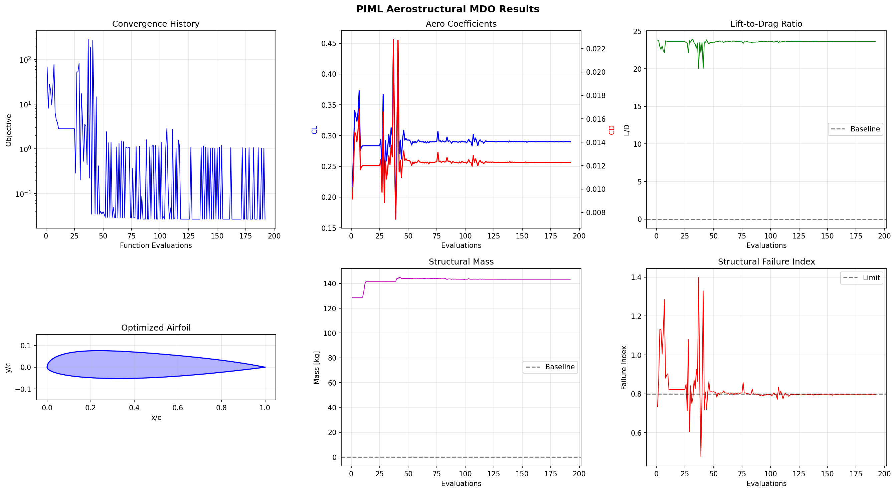
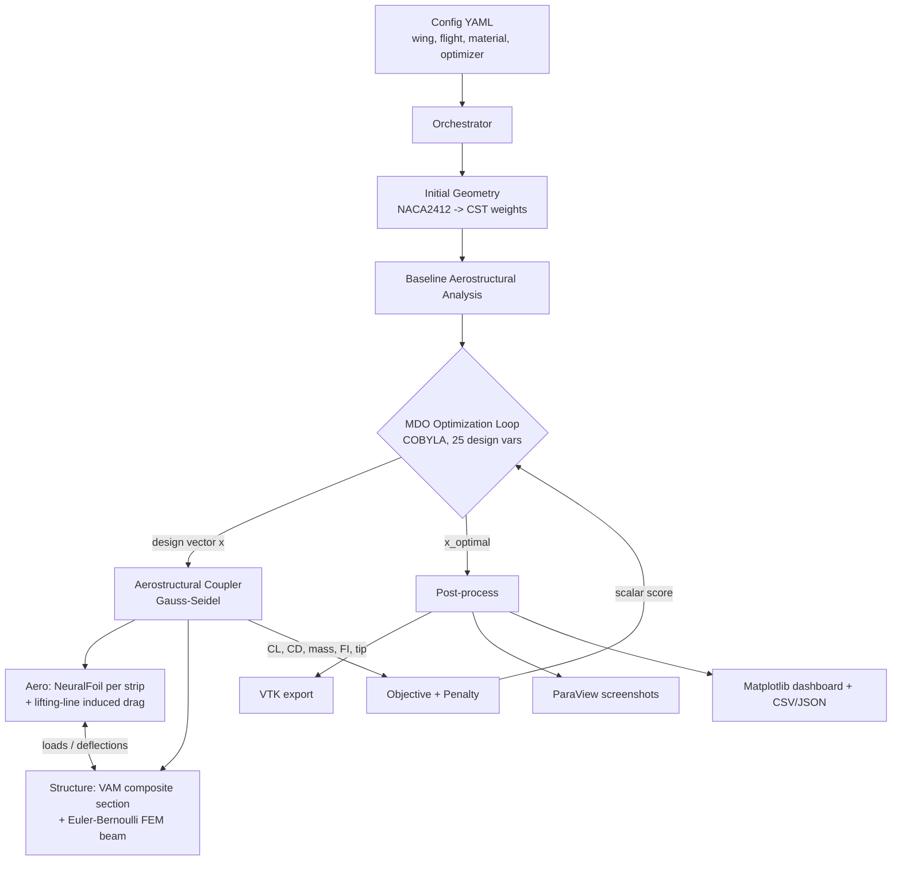
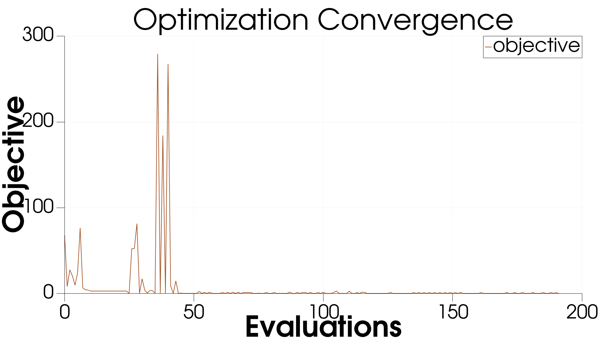
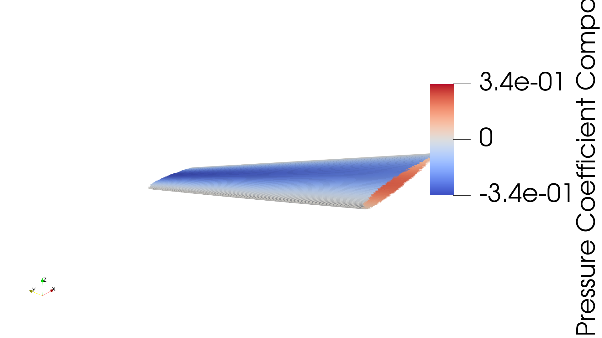
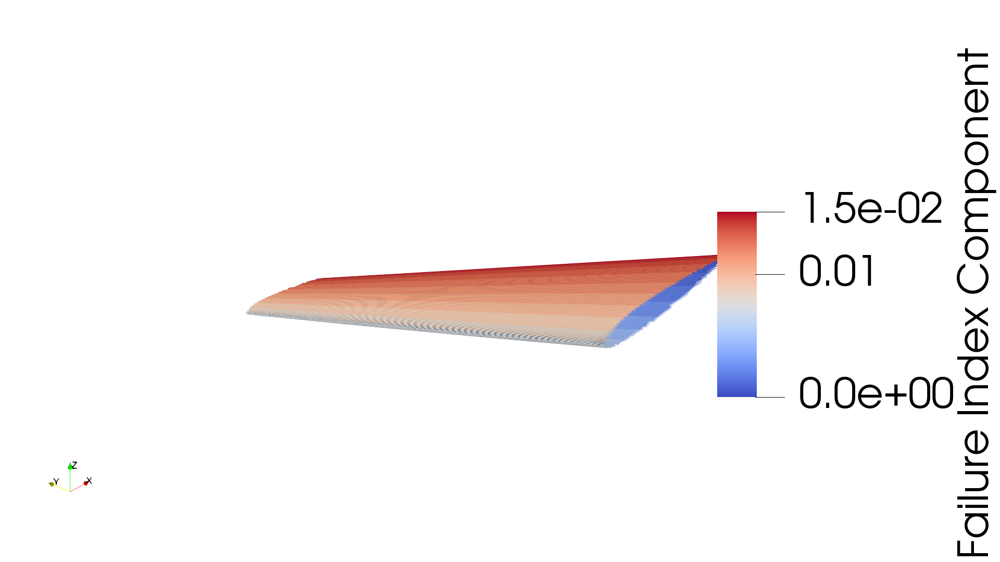
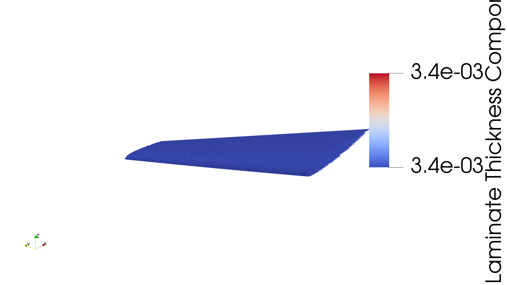
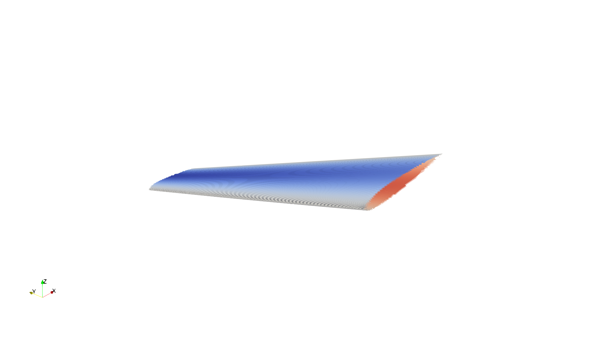
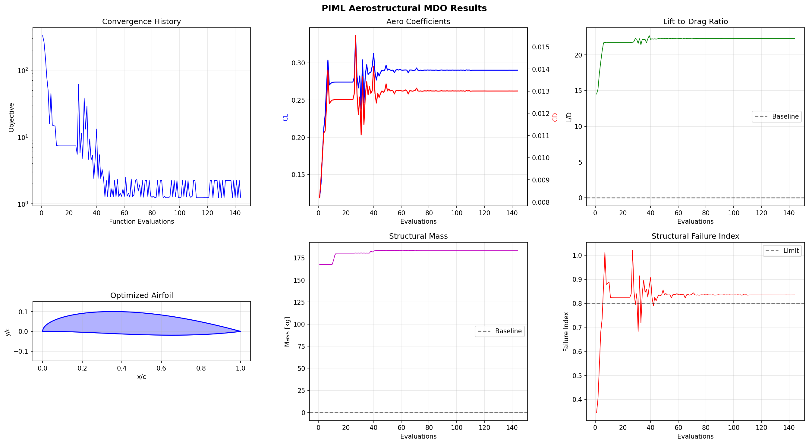
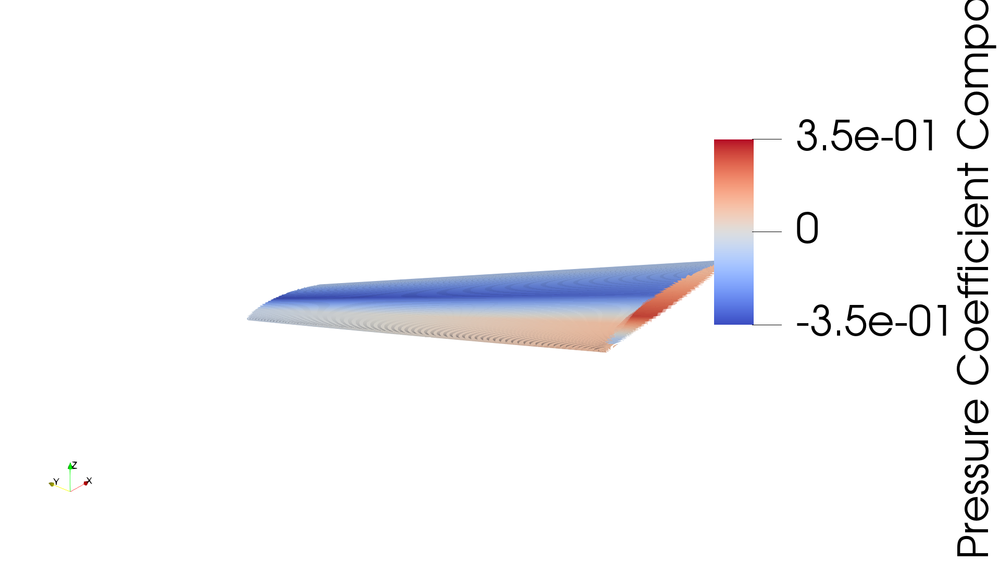

# Build 1 — Low-Fidelity Prototype (NeuralFoil/VLM + VAM Beam)

**Physics-Informed, ML-accelerated Multidisciplinary Design Optimization of a composite aircraft wing — the foundational build.**

> **This is the earlier, foundational build.** It is complete, validated, and fully real (every number below came from an actual run) — but it has been superseded as the primary reference by **[Build 2](README.md)**, which replaces its low-fidelity aerodynamics and 1-D structural beam with real 3-D CFD (SU2) and real per-element composite shell analysis (MYSTRAN). Build 1's own limitations (§10 below) are exactly what motivated Build 2 — see the [Build 2 README](README.md) for the current, actively-developed pipeline.

---

## Table of Contents

1. [TL;DR — Results](#1-tldr--results)
2. [The Big Picture](#2-the-big-picture)
3. [The Physics Stack](#3-the-physics-stack)
4. [The Optimization Problem](#4-the-optimization-problem)
5. [Repository & Code Map](#5-repository--code-map)
6. [How to Run](#6-how-to-run)
7. [Results & Visualizations](#7-results--visualizations)
8. [What Made Everything Work — the 181× Fix](#8-what-made-everything-work--the-181-fix)
9. [Output Files Reference](#9-output-files-reference)
10. [Limitations of Build 1](#10-limitations-of-build-1)
11. [Build 1b — 3-D VLM Variant](#11-build-1b--3-d-vlm-variant)

---

**Status: ✅ complete and validated.** Everything in this document has been run, produced real output files, and is reproducible with the commands in §6.

## 1. TL;DR — Results

The optimizer takes an **infeasible** baseline wing (it would break: failure index 1.50 > 1.0) and drives it to a **feasible, trimmed** design — sized precisely to the structural limit.

| Metric | Baseline (NACA2412) | Optimized | Meaning |
|---|---|---|---|
| **C_L** | 0.429 (untrimmed) | **0.290** | Trimmed to the 0.30 cruise target |
| **C_D** (integrated + induced) | — | **0.01228** | Total drag coefficient |
| **L/D** | — | **23.6** | Cruise efficiency |
| **Structural mass** | 128.8 kg | **143.4 kg** | Semi-span wing-box mass |
| **Failure index** | **1.497 → fails** | **0.795 → safe** | Tsai–Wu, must be ≤ 0.8 |
| **Tip deflection** | 0.022 m | 0.017 m | Negligible, stiff wing |
| **Function evals / wall time** | — | 192 / **145 s** | COBYLA optimization |

**Optimized design:** α = 3.10°, skin thickness scale ≈ 1.15 (root) → 1.09 (tip), ply counts ≈ `[0°×8, +45°×2, −45°×2, 90°×1]` per half-stack.



*Six-panel dashboard: objective convergence (top-left), aero coefficients, L/D, optimized airfoil, structural mass, and the failure index converging exactly onto the 0.8 limit — the hallmark of an **active structural constraint**.*

---

## 2. The Big Picture



**One sentence:** for every candidate design the optimizer proposes, the pipeline runs a full aero↔structure coupling loop to convergence, scores it, and repeats — then renders the winner.

The name **PIML** (Physics-Informed Machine Learning) comes from the aero solver: **NeuralFoil** is a neural network trained on ~2M XFoil viscous airfoil simulations. It gives near-CFD 2-D airfoil polars in ~3.6 ms instead of seconds — the "learned" physics that makes an inner coupling loop with hundreds of evaluations affordable on a laptop.

---

## 3. The Physics Stack

### 3.1 Aerodynamics — NeuralFoil + strip theory + lifting-line induced drag

| Piece | File | What it does |
|---|---|---|
| **Airfoil shape** | `aero/airfoil_geometry.py` | Class-Shape Transformation (CST / Kulfan). 3 upper + 3 lower Bernstein weights define a smooth, differentiable airfoil. Initialized by fitting CST weights to a NACA 4-digit section. |
| **2-D section solver** | `aero/neuralfoil_wrapper.py` | Wraps NeuralFoil `xlarge`. Given `(coords, α, Re)` returns `C_l, C_d, C_m` in ~3.6 ms. |
| **3-D spanwise buildup** | `coupling/load_transfer.py → compute_section_aero` | Strip theory: evaluate NeuralFoil at each of 21 spanwise stations (local α = geometric + twist, local Re = Re·chord), then convert to distributed lift/moment. |
| **Induced drag** | same | Lifting-line estimate `C_di = C_l² / (π·AR)` added per strip so drag isn't purely 2-D. |

**Why NeuralFoil instead of VLM/CFD?** It captures *viscous* 2-D drag (which a Vortex Lattice Method cannot) at neural-network speed, so the coupled loop stays cheap. The trade-off is that 3-D effects come from strip theory + a lifting-line correction rather than a full 3-D solve. §11 covers the VLM variant of this same build.

### 3.2 Structures — composite CLT → VAM cross-section → FEM beam

The wing box is modeled as a 1-D beam whose spanwise stiffness comes from real composite laminate theory:

| Layer | File | Physics |
|---|---|---|
| **Ply → laminate stiffness** | `structures/composite_properties.py` | Classical Lamination Theory (CLT). Each ply's reduced stiffness `Q` is rotated (`Q_bar`) by its angle; integrating through the stack gives the 6×6 **ABD matrix**. |
| **Laminate → beam stiffness** | `structures/vam_section.py` | A VAM-aligned thin-walled box: the four walls (2 skins + 2 spars) are integrated around the perimeter (Gauss–Legendre) to build the 6×6 cross-sectional stiffness → EA, EI, GJ, and **bend–twist coupling**. |
| **Beam solve** | `structures/beam_solver.py` | Euler–Bernoulli FEM (Hermite cubic bending + linear torsion elements) clamped at the root. Returns deflection, twist, bending/shear stress, mass, tip deflection, and the **Tsai–Wu failure index**. |
| **Failure criterion** | `composite_properties.py → tsai_wu_failure` | Ply-level Tsai–Wu using material allowables (Xt, Xc, Yt, Yc, S12). The max over all plies/stations is the failure index; the ultimate load factor (2.5g) is applied to loads first. |

**Material:** IM7/8552 CFRP — E1 = 171 GPa, E2 = 9.08 GPa, G12 = 5.29 GPa, ν12 = 0.32, ρ = 1580 kg/m³, Xt = 2326 MPa.

**Baseline layup (`thick_wing_skin`):** `[45, −45, 0, 0, 0, 0, 90, 0, 0, 0, 0, 45, −45]ₛ` — a 13-ply half-stack mirrored to a symmetric 26-ply skin, 0°-dominated for spanwise bending strength.

> **Known resolution limit (addressed in Build 2):** this beam model resolves stress **per ply** at each span station, but lumps the entire cross-section perimeter into **one averaged membrane state** (`Nx = M/(h·w)`) — it cannot distinguish stress at the leading edge from stress at the spar. [Build 2](README.md) replaces this with MYSTRAN, a real shell FE solver with genuine per-element resolution.

### 3.3 Coupling — Gauss–Seidel aeroelastic loop

`coupling/load_transfer.py → AerostructuralCoupler.solve` iterates:

```
for k in range(max_coupling_iters):           # default 5
    aero   = strip_theory(NeuralFoil, twist)  # loads from current shape
    struct = beam_solve(aero.lift, aero.moment, load_factor)
    Δw     = max|deflection_k − deflection_{k-1}|
    if Δw < tol: break                         # tol = 1e-3
    twist       += relax · structural_twist    # deformation feeds back into aero
    deflection   = relax · new + (1−relax) · old   # relaxation = 0.5
```

Aerodynamic loads bend and twist the wing; the deformed twist changes the loads; repeat until the deflection stops changing. This converges in ~5 iterations here (a stiff wing).

### 3.4 The "physics-informed ML" thread

- **NeuralFoil** — NN surrogate of XFoil viscous aerodynamics (the always-on PIML component in Build 1).
- **`structures/structural_surrogate.py`** — a PyTorch MLP scaffold for a MYSTRAN-trained structural surrogate. Code exists; it is **untrained and unused** in every Build 1 run to date. Build 2 does not use this scaffold — a trained network turned out to be unnecessary once real MYSTRAN timing was measured (~0.25–1.8 s/solve is already fast enough).
- **`aero/surrogate_cfd.py`** — optional MLP trained on OpenAeroStruct VLM data. Not used in the runs reported here.
- **`aero/pinn_solver.py`** — a PINN hook for RANS-level aero. Superseded by Build 2's planned Aero-PINN, which is trained on real SU2 data rather than this hook.

---

## 4. The Optimization Problem

Defined in `optimization/mdo_problem.py`, solved by `optimization/optimizer.py`.

**25 design variables:**

| Group | Count | Bounds | Role |
|---|---|---|---|
| CST upper weights | 3 | [−0.5, 0.8] | Airfoil upper surface |
| CST lower weights | 3 | [−0.8, 0.5] | Airfoil lower surface |
| Twist stations | 3 | [−10°, 10°] | Spanwise washout |
| Structural thickness scale | 3 | [0.3, 3.0] | Skin sizing multiplier |
| Ply counts (3 stations × 4 angles) | 12 | [0, 16] | Composite layup `{0, ±45, 90}` |
| Angle of attack | 1 | [−2°, 12°] | Trim |

Ply counts are continuous in the optimizer and **rounded to integers** inside `_apply_design_to_wing()`; each station builds a symmetric laminate mirrored about the mid-plane. **This exact continuous-relaxation pattern is reused unchanged in Build 2.**

**Objective** (minimize):

```
f(x) = C_D · w_drag  +  w_mass · (mass / 1000)   [w_drag = 1.0, w_mass = 0.1]
```

**Constraints** (exterior quadratic penalty method):

| Constraint | Value | Penalty weight |
|---|---|---|
| Trim: \|C_L − 0.30\| ≤ 0.01 | cruise lift | 10 000 (heavy — can't cheat lift) |
| Failure index ≤ 0.8 | Tsai–Wu safety | 100 |
| Tip deflection ≤ 1.5 m | stiffness | 100 |
| 0.08 ≤ t/c ≤ 0.20 | manufacturability | 100 |

**Optimizer:** SciPy **COBYLA** (gradient-free, constraint-friendly). The pipeline also supports `L-BFGS-B`, `SLSQP`, `differential_evolution`, and `pyOptSparse` (SNOPT/IPOPT) via the same interface. Repeated design vectors are cached (rounded to 8 decimals) so line-search revisits don't re-run the coupling.

> **Note on coefficient definitions.** The *baseline* summary prints a 2-D **mean-sectional** L/D (no induced drag → looks high, ~79), while the *optimized* value is the **span-integrated** C_D **with** the lifting-line induced term (~23.6). They use different definitions and are not directly comparable — the honest story is the **failure index going 1.50 → 0.79** (infeasible → feasible).

---

## 5. Repository & Code Map

```
piml_mdo/                         # active discipline package
├── aero/
│   ├── airfoil_geometry.py       # CST (Kulfan) airfoil parameterization
│   ├── neuralfoil_wrapper.py     # NeuralFoil xlarge surrogate  ← always-on PIML
│   ├── openaerostruct_solver.py  # VLM aero (Build 1b, §11)
│   ├── surrogate_cfd.py          # unused MLP-on-VLM aero scaffold
│   └── pinn_solver.py            # unused PINN aero hook
├── structures/
│   ├── composite_properties.py   # CLT, ABD matrix, Tsai–Wu, materials & layups
│   ├── vam_section.py            # VAM thin-walled box cross-section stiffness
│   ├── beam_solver.py            # Euler–Bernoulli FEM beam (bending+torsion)
│   ├── structural_surrogate.py   # unused PyTorch MLP scaffold
│   └── mystran_runner.py         # MYSTRAN/pyNastran driver (used offline here; primary solver in Build 2)
├── coupling/
│   └── load_transfer.py          # FlightCondition, strip-theory aero, Gauss–Seidel coupler
├── optimization/
│   ├── mdo_problem.py            # design vars, objective, constraints, penalties
│   └── optimizer.py              # scipy / pyOptSparse wrapper — reused as-is in Build 2
├── pipeline/
│   └── orchestrator.py           # wires it all together, runs stages, saves outputs
└── utils/
    ├── plotting.py               # the 6-panel matplotlib dashboard
    ├── vtk_export.py             # undeformed/deformed wing → .vtk
    └── paraview_screenshots.py   # headless pvpython renders

config/piml_aerostruct_run.yaml   # production aircraft configuration
scripts/run_pipeline.py           # entry point
scripts/validate_installation.py  # dependency check
scripts/generate_structural_doe.py + train_structural_surrogate.py
assets/pipeline/                  # Build 1 (NeuralFoil) images
assets/pipeline_vlm/              # Build 1b (VLM) images
```

**The orchestrator's 6 stages** (`pipeline/orchestrator.py`):

1. **Initialize** — build aero solver, laminate, `WingStructure`, beam solver, coupler, MDO problem, optimizer.
2. **Create Initial Geometry** — NACA2412 → CST weights.
3. **Baseline Analysis** — one coupling solve on the starting wing.
4. **MDO Optimization** — COBYLA drives the 25-DV problem.
5. **Post-Process** — final coupling solve → VTK export.
6. **Save Results** — JSON/CSV + ParaView screenshots + dashboard.

---

## 6. How to Run

```bash
# 0. Validate the environment (OpenAeroStruct, OpenMDAO, PyTorch, NeuralFoil, ParaView)
python scripts/validate_installation.py

# 1. Full production run (COBYLA, 50 iters → ~192 evals, ~2.5 min)
python scripts/run_pipeline.py --config config/piml_aerostruct_run.yaml --output results/goal_run

# 2. Quick smoke test (10 iters)
python scripts/run_pipeline.py --config config/piml_aerostruct_run.yaml --quick --output results/quick_test

# 3. Swap to the Build 1b VLM aero solver (see §11)
python scripts/run_pipeline.py --config config/piml_aerostruct_run.yaml --solver openaerostruct

# (optional) Generate MYSTRAN structural DOE — used offline here, and the source
# of the real timing benchmark that shaped the Build 2 architecture
python scripts/generate_structural_doe.py --n_samples 50 --output results/structural_doe/doe.csv
python scripts/train_structural_surrogate.py --doe results/structural_doe/doe.csv --output results/structural_doe/surrogate.pt
```

**Key config knobs** (`config/piml_aerostruct_run.yaml`): wing planform (semi-span 6 m, chords 4.5/1.5 m, 35° sweep), flight (V = 255 m/s, 10 km, C_L target 0.30), material/layup, optimizer method + iterations, coupling settings, and constraint limits.

**Environment:** Python 3.12 · NumPy 1.26.4 · SciPy · OpenMDAO 3.40 · OpenAeroStruct 2.11 · NeuralFoil · PyTorch 2.5.1 · ParaView 5.13 (pvpython).

---

## 7. Results & Visualizations

All artifacts below come from a full production run (NeuralFoil aero).

### 7.1 Convergence

The objective drops from ~300 → 0.027 and the constraint penalty reaches exactly **0.0**. Crucially, the failure index settles right on the 0.8 limit — the structure is sized to be *precisely* feasible, not over-built.



### 7.2 Pressure distribution (aerodynamics)

Surface pressure coefficient on the optimized wing, rendered in ParaView from the coupled solution. **This is a synthetic `sin(πx)·C_L` placeholder profile**, not a solved pressure field — Build 1's NeuralFoil path has no chordwise pressure distribution to draw from. Compare to §11's VLM-derived field, which is a real (if inviscid) panel loading.



### 7.3 Failure index (structures)

Spanwise Tsai–Wu failure index. It peaks near the root (highest bending moment) and stays under the limit — the active constraint that drove the sizing.



### 7.4 Laminate thickness (sizing)

Optimized skin thickness distribution — thicker inboard where loads are highest, tapering toward the tip.



### 7.5 Undeformed vs. deformed wing (aeroelasticity)

<table>
<tr>
<td></td>
<td></td>
</tr>
<tr>
<td align="center"><b>Undeformed (jig shape)</b></td>
<td align="center"><b>Deformed under 1g cruise load</b></td>
</tr>
</table>

---

## 8. What Made Everything Work — the 181× Fix

The pipeline was physically complete but had a crippling performance bug that put a full run on a **~2-hour** trajectory. Profiling isolated it precisely.

**Symptom:** each aerostructural evaluation took ~40 s; the run would need ~192 of them.

**Root cause:** every coupling iteration calls the beam solver, which calls `WingStructure.section_properties()` (the VAM cross-section solve). That single call was measured at **8.1 seconds**. Inside `VAMSection.stiffness_matrix()`, each Gauss-point integrand recomputed the wall's **ABD matrix** — a 26-ply, trig-heavy CLT assembly (`ABD_matrix()`) — even though the ABD is *constant along a wall*. With ~8 integrals × 4 walls × 16 Gauss points × 21 spanwise stations, that's **~10,000+ ABD rebuilds per call**.

**The fix** (`structures/vam_section.py`), numerically identical to machine precision:

1. **Cache each wall's ABD once per laminate** — the ABD depends only on the laminate, so assemble it once and reuse it at every integration point.
2. **Precompute the Gauss–Legendre points once** in `__init__` instead of re-calling `leggauss` inside every wall loop.

```python
# Before: ABD rebuilt at every Gauss point
def _wall_abd(self, wall):
    return wall.laminate.ABD_matrix()          # ~10,000 calls / section

# After: assembled once per unique laminate
def _wall_abd(self, wall):
    key = id(wall.laminate)
    abd = self._abd_cache.get(key)
    if abd is None:
        abd = wall.laminate.ABD_matrix()        # ~2 calls / section
        self._abd_cache[key] = abd
    return abd
```

**Result:**

| | Before | After | Speedup |
|---|---|---|---|
| `section_properties()` | 8113 ms | **44.8 ms** | **181×** |
| Full pipeline run | ~2 hours | **161 s** | ~45× |

Because the change only caches a quantity that was already constant, every EI/GJ/EA/mass value — and therefore every optimization result — is unchanged. It's a pure speed fix, and it's what makes the whole "hundreds of coupled evaluations on a laptop" premise actually hold.

---

## 9. Output Files Reference

Each run writes to `results/<run_name>/<project_name>/`:

| File | Contents |
|---|---|
| `optimization_summary.json` | Final objective, C_L, C_D, L/D, mass, failure index, tip deflection, all 25 optimized design variables. |
| `optimization_history.json` | Per-evaluation trace (192 rows): objective, aero coefficients, mass, FI, penalty, wall-clock time. |
| `optimization_convergence.csv` | Same history flattened for spreadsheets/plotting. |
| `optimized_airfoil.dat` | Final airfoil coordinates (x, y). |
| `*_wing_undeformed.vtk` / `*_wing_deformed.vtk` | 3-D wing surfaces with pressure & failure-index fields for ParaView. |
| `mdo_results.png` | 6-panel matplotlib dashboard. |
| `paraview_screenshots/*.png` | 6 headless ParaView renders (geometry, pressure, failure, thickness, convergence). |
| `config.json` / `pipeline_stages.json` | Exact config used + per-stage timing/status. |

---

## 10. Limitations of Build 1

- Aero (NeuralFoil path) is **strip theory + lifting-line**, not a 3-D solve — no wake roll-up, shock, or separation modeling. The VLM variant (§11) fixes the 3-D load distribution but is still inviscid.
- Structure is a **1-D beam** with a lumped-perimeter stress approximation (§3.2 note) — no local skin buckling, no per-element resolution, no rib/stiffener detail.
- Optimization is **gradient-free** (COBYLA); fine for 25 DVs, but doesn't scale to hundreds.
- **Single 1g cruise point** — a real wing is sized by a maneuver/gust envelope.
- Baseline vs. optimized coefficients use different definitions (see §4 note).

**All five of these are exactly what motivated [Build 2](README.md)**: real 3-D CFD pressure (SU2), real per-element composite stress (MYSTRAN), and a physics-based resizing engine (VAM Fully-Stressed-Design) replacing the beam-only approximation. See the [Build 2 README](README.md) for the current pipeline and real results.

---

## 11. Build 1b — 3-D VLM Variant

Still within Build 1 (same VAM beam, same optimizer) — this swaps the aero solver from NeuralFoil strip theory to OpenAeroStruct's **Vortex Lattice Method (VLM)**, giving a real 3-D lifting-surface load distribution instead of a stacked-2-D approximation.

> **Honest scope — VLM is not CFD.** VLM is a 3-D *lifting-surface / potential-flow* method: it solves the whole 3-D wing at once and captures the real spanwise + chordwise load distribution and induced drag from the 3-D trailing-vortex system. It has **no viscosity, boundary layer, or shocks**, and its per-panel "pressure" is a loading **ΔCp**, not a viscous CFD surface-pressure field. True CFD surface pressure is [Build 2's SU2 module](README.md#3-module-1--su2-cfd).

### What is built and validated

- **`OpenAeroStructSolver.solve_wing_distribution()`** (`aero/openaerostruct_solver.py`) runs **one** 3-D VLM solve of the whole wing and extracts, from the panel forces (`sec_forces`):
  - the true **spanwise lift, drag and pitching-moment distributions** (chordwise-integrated per strip),
  - a per-panel **ΔCp loading field** + the deformed VLM mesh for 3-D visualization,
  - whole-wing `CL`, `CD`.
- **Twist injection** through the geometry B-spline control points, so the structural washout feedback enters the aero solve.

### Validation (standalone)

| Check | Result |
|---|---|
| Extracted lift integrates back to OAS `CL` | 0.1905 vs 0.1907 (<0.1% error) ✅ |
| Single 3-D solve time | ~0.085 s ✅ |
| Washout (−4° tip) offloads the tip | lift/m tip 7337 → 3390 N/m, CL 0.31 → 0.20 ✅ |
| Spanwise lift shape | root-loaded, monotonic to tip ✅ |

### Why the naïve switch was wrong (and the fix)

The coupler originally called `aero_solver.evaluate()` **once per spanwise station**, which returns *whole-wing* coefficients — so simply flipping `--solver openaerostruct` would run 21 redundant 3-D solves per coupling iteration and **mislabel whole-wing CL as a sectional load**. The `solve_wing_distribution` path fixes this: **one** solve → real spanwise distribution → VAM composite beam.

A second bug surfaced during integration: drag taken from the body-axis streamwise panel force gave a **negative** C_D (dominated by leading-edge suction, not real drag). Fixed by using the whole-wing VLM `C_D` (Trefftz-plane, induced + viscous) distributed proportionally to local chord.

### Result: full production run, VLM aero + VAM structure

144 evaluations, 70.5 s wall time, **C_L = 0.290** (trimmed), **C_D = 0.0130**, **L/D = 22.3**, mass = 183.5 kg, **failure index = 0.835** — near the 0.8 feasibility limit but **not fully inside it**; the run was stopped before full convergence to feasibility (a manual thickness sweep separately confirmed FI = 0.636 is reachable at `struct_scale ≈ 1.5`, so this is a tuning gap, not a physics problem).

### VLM+VAM run visuals (near-feasible, FI = 0.835)





*Unlike the NeuralFoil-run pressure image in §7.2 (a synthetic `sin(πx)·C_L` placeholder), this ΔCp field comes directly from the VLM panel loading — a real, if inviscid, 3-D pressure distribution.*

---

*This is the Build 1 reference document. For the current pipeline (real 3-D CFD, real composite shell structure, real aerodynamic shape optimization), see [README.md](README.md).*
